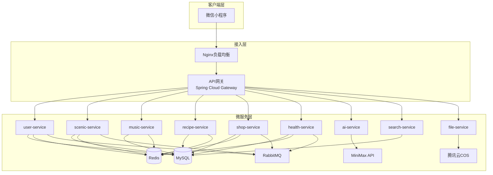

# 肇庆旅游小程序 - 疗愈生活

<p align="center">
  
  
  
  
</p>

<p align="center">
  <b>集景点推荐、音乐疗愈、健康管理、AI助手、电商购物于一体的综合性旅游服务平台</b>
</p>

---

## 📋 项目简介

肇庆旅游小程序以"疗愈生活"为核心理念，结合肇庆本地丰富的旅游资源，为用户提供身心放松、健康管理的全方位旅游体验。项目采用先进的微服务架构，支持高并发、高可用、可扩展的业务需求。

### ✨ 核心功能

- 🏞️ **景点探索** - 发现肇庆美景，智能推荐，收藏管理
- 🤖 **AI助手** - 智能问答、行程规划、心灵疗愈
- 🎵 **音乐疗愈** - 放松音乐、冥想音频、自然声音
- 🍳 **健康食谱** - 养生食谱、烹饪记录、每日推荐
- 🛒 **电商购物** - 旅游特产、便捷购物、订单管理
- 💓 **健康管理** - 心率监测、步数统计、运动建议

---

## 🏗️ 项目架构

### 系统架构图



### 技术栈

| 层级 | 技术选型 | 版本 |
|------|----------|------|
| **前端** | 微信小程序原生开发 | - |
| **后端框架** | Spring Boot + Spring Cloud Alibaba | 3.2.x / 2023.0.1.0 |
| **数据库** | MySQL | 8.0.x |
| **缓存** | Redis | 7.2.x |
| **消息队列** | RabbitMQ | 3.12.x |
| **文件存储** | 腾讯云COS | - |
| **AI服务** | MiniMax API | - |
| **API网关** | Spring Cloud Gateway + Nginx | - |
| **服务治理** | Nacos + Sentinel | - |
| **CI/CD** | GitLab CI/CD + Docker | - |
| **代码质量** | Spotless + Checkstyle + JaCoCo | - |
| **容器化** | Docker + Kubernetes | 24.x / 1.28.x |
| **开发语言** | Java | OpenJDK 17 |

---

## 📁 项目结构

```
肇庆旅游项目/
├── 📱 肇庆旅游_前端/                 # 微信小程序前端代码
│   └── zq_travel_frontend/
│       ├── components/              # 公共组件
│       │   ├── bottom-bar/          # 底部导航栏
│       │   ├── custom-icon/         # 自定义图标
│       │   ├── empty/               # 空状态组件
│       │   ├── fab/                 # 浮动按钮
│       │   ├── grid-menu/           # 网格菜单
│       │   ├── healing-icon/        # 疗愈图标
│       │   ├── immersive-player/    # 沉浸式播放器
│       │   ├── markdown-render/     # Markdown渲染
│       │   ├── skeleton/            # 骨架屏
│       │   └── timeline/            # 时间线
│       ├── pages/                   # 页面文件
│       │   ├── index/               # 首页
│       │   ├── ai-agent/            # AI助手
│       │   ├── music/               # 音乐
│       │   ├── player/              # 播放器
│       │   ├── playlist-detail/     # 播放列表详情
│       │   ├── scenic-detail/       # 景点详情
│       │   ├── recipe-detail/       # 食谱详情
│       │   ├── shop-detail/         # 商品详情
│       │   ├── search/              # 搜索
│       │   ├── recommend-detail/    # 推荐详情
│       │   ├── heart-rate-detail/   # 心率详情
│       │   ├── steps-detail/        # 步数详情
│       │   └── mine/                # 我的
│       ├── custom-tab-bar/          # 自定义TabBar
│       ├── utils/                   # 工具函数
│       ├── config/                  # 配置文件
│       ├── app.js                   # 小程序入口
│       ├── app.json                 # 全局配置
│       └── app.wxss                 # 全局样式
│
├── 🔧 肇庆旅游_后端/                 # 后端微服务代码
│   └── zq_travel_backend/
│       ├── common/                  # 公共模块
│       │   ├── common-core/         # 核心工具类
│       │   ├── common-web/          # Web通用组件
│       │   └── common-redis/        # Redis通用组件
│       ├── gateway/                 # API网关 (Spring Cloud Gateway)
│       ├── services/                # 微服务模块
│       │   ├── user-service/        # 用户服务 (8001)
│       │   ├── scenic-service/      # 景点服务 (8002)
│       │   ├── music-service/       # 音乐服务 (8003)
│       │   ├── recipe-service/      # 食谱服务 (8004)
│       │   ├── shop-service/        # 商店服务 (8005)
│       │   ├── health-service/      # 健康服务 (8006)
│       │   ├── ai-service/          # AI服务 (8007)
│       │   ├── search-service/      # 搜索服务 (8008)
│       │   └── file-service/        # 文件服务 (8009)
│       ├── config/                  # 配置中心文件
│       │   └── checkstyle/          # 代码规范配置
│       ├── docs/                    # 项目文档
│       │   └── MODULE_STRUCTURE.md  # 模块结构说明
│       ├── docker-compose.yml       # 开发环境编排
│       ├── .gitlab-ci.yml           # CI/CD流水线配置
│       └── pom.xml                  # 父POM
│
├── 📖 项目需求文档.md                # 产品需求文档 (PRD)
├── 🏗️ system_architecture_design.md # 系统架构设计文档
├── 🔌 backend_api_interfaces.md     # 后端API接口清单
├── 🤖 AGENTS.md                     # 开发规范文档
├── 📄 LICENSE                       # MIT开源许可证
└── 📋 README.md                     # 项目总览 (本文件)
```

---

## 🚀 快速开始

### 环境要求

- **JDK**: 17+
- **Maven**: 3.8+
- **Node.js**: 16+ (前端开发)
- **MySQL**: 8.0+
- **Redis**: 7.0+
- **RabbitMQ**: 3.12+
- **Docker**: 24.x (可选，用于容器化部署)

### 后端启动

```bash
# 1. 克隆项目
git clone <repository-url>
cd 肇庆旅游项目/肇庆旅游_后端/zq_travel_backend

# 2. 编译项目
mvn clean package -DskipTests

# 3. 启动基础服务 (使用Docker Compose)
docker-compose up -d mysql redis rabbitmq nacos

# 4. 启动网关
cd gateway
mvn spring-boot:run

# 5. 启动各个微服务 (分别在各自目录执行)
cd ../services/user-service
mvn spring-boot:run
```

### 前端启动

```bash
# 1. 使用微信开发者工具打开项目
cd 肇庆旅游项目/肇庆旅游_前端/zq_travel_frontend

# 2. 在微信开发者工具中导入项目
# 选择 project.config.json 文件

# 3. 修改配置文件中的API地址
# 修改 config/ai-config.js 中的 baseUrl
```

---

## 📊 项目统计

| 指标 | 数值 |
|------|------|
| **功能模块** | 14个 |
| **API接口** | 79个 |
| **微服务** | 9个 |
| **前端页面** | 16个 |
| **开发周期** | 8周 |

### 功能模块清单

| 模块 | 接口数 | 优先级 | 状态 |
|------|--------|--------|------|
| 用户管理 | 6 | P0 | 🚧 开发中 |
| 首页数据 | 4 | P0 | 🚧 开发中 |
| 景点管理 | 6 | P0 | 🚧 开发中 |
| AI助手 | 6 | P0 | 🚧 开发中 |
| 搜索模块 | 6 | P0 | 🚧 开发中 |
| 音乐模块 | 8 | P0 | 🚧 开发中 |
| 播放器 | 7 | P1 | 📋 待开发 |
| 食谱模块 | 7 | P0 | 🚧 开发中 |
| 商店模块 | 12 | P0 | 🚧 开发中 |
| 健康数据 | 6 | P1 | 📋 待开发 |
| 推荐详情 | 3 | P1 | 📋 待开发 |
| 收藏管理 | 3 | P1 | 📋 待开发 |
| 系统配置 | 2 | P1 | 📋 待开发 |
| 文件上传 | 3 | P1 | 📋 待开发 |

---

## 📖 文档目录

| 文档 | 说明 |
|------|------|
| [项目需求文档](./项目需求文档.md) | 产品需求文档 (PRD)，包含完整的功能需求和非功能需求 |
| [系统架构设计文档](./system_architecture_design.md) | 系统架构设计，包含技术选型、数据库设计、部署方案 |
| [后端API接口清单](./backend_api_interfaces.md) | 79个API接口的详细清单 |
| [开发规范文档](./AGENTS.md) | 代码开发规范、Git工作流、API设计规范 |
| [LICENSE](./LICENSE) | MIT开源许可证 |
| [模块结构说明](./肇庆旅游_后端/zq_travel_backend/docs/MODULE_STRUCTURE.md) | 后端模块结构详细说明 |

### 开发记录

| 记录 | 说明 |
|------|------|
| [01_Git忽略文件创建](./开发记录/01_Git忽略文件创建/) | 项目Git忽略文件配置 |
| [02_基础框架搭建](./开发记录/02_基础框架搭建/) | M1阶段基础框架搭建 |
| [03_StringUtils修复](./开发记录/03_StringUtils修复/) | 编译错误修复记录 |
| [04_公共模块开发](./开发记录/04_公共模块开发/) | common-web + common-redis开发 |
| [05_微服务基础设施配置](./开发记录/05_微服务基础设施配置/) | Gateway + Docker Compose + Nacos |
| [06_CI/CD流水线配置](./开发记录/06_CI_CD流水线配置/) | GitLab CI/CD + 代码质量检查 |

---

## 🛠️ 开发规范

### 代码规范

- 使用 **Java 17** 进行开发
- 遵循 **Spring Boot** 最佳实践
- 代码注释使用 **JavaDoc** 格式
- 使用 **4个空格** 缩进，禁止Tab
- 代码格式化使用 **Spotless** (`mvn spotless:apply`)
- 代码规范检查使用 **Checkstyle** (`mvn checkstyle:check`)

### Git工作流

```bash
# 功能开发
feature/功能名称 -> develop -> main

# 提交规范
feat: 新功能
fix: 修复bug
docs: 文档更新
style: 代码格式调整
refactor: 代码重构
test: 测试相关
chore: 构建过程或辅助工具变动
```

### CI/CD流水线


| 阶段 | 命令 | 说明 |
|------|------|------|
| build | `mvn clean compile` | 编译项目 |
| test | `mvn test` | 执行单元测试 |
| quality | `mvn spotless:check` + `mvn checkstyle:check` | 代码质量检查 |
| package | `mvn package` + `docker build` | 打包并构建镜像 |
| deploy-dev | `docker push` | 推送镜像到开发环境 |

### 开发流程

1. **需求分析** - 阅读 [项目需求文档](./项目需求文档.md)
2. **技术设计** - 参考 [系统架构设计文档](./system_architecture_design.md)
3. **接口定义** - 参考 [后端API接口清单](./backend_api_interfaces.md)
4. **编码实现** - 遵循 [开发规范文档](./AGENTS.md)
5. **代码格式化** - 执行 `mvn spotless:apply`
6. **测试验证** - 单元测试 + 集成测试
7. **文档归档** - 按照 [归档协议](./开发记录/规则.md) 完成文档

---

## 📅 项目排期

| 阶段 | 时间 | 内容 | 里程碑 |
|------|------|------|--------|
| **第一阶段** | 第1-2周 | 基础架构搭建 | M1: 架构完成 |
| **第二阶段** | 第3-4周 | 核心功能开发 | M2: 核心功能完成 |
| **第三阶段** | 第5-6周 | 业务功能开发 | M3: 全部功能完成 |
| **第四阶段** | 第7周 | 集成测试 | - |
| **第五阶段** | 第8周 | 性能优化 & 上线 | M4: 正式上线 |

---

## 🤝 贡献指南

1. **Fork** 本仓库
2. 创建 **Feature** 分支 (`git checkout -b feature/AmazingFeature`)
3. **提交** 更改 (`git commit -m 'Add some AmazingFeature'`)
4. **推送** 到分支 (`git push origin feature/AmazingFeature`)
5. 创建 **Pull Request**

---

## 📞 联系我们

- **项目负责人**: Achieve
- **产品经理**: Mini
- **技术负责人**: Max
- **邮箱**: 
  - 2105268075@qq.com
  - achieve.minimax@gmail.com

---

## 📄 许可证

本项目采用 [MIT License](LICENSE) 开源许可证。

```
MIT License

Copyright (c) 2026 肇庆旅游小程序团队

Permission is hereby granted, free of charge, to any person obtaining a copy
of this software and associated documentation files (the "Software"), to deal
in the Software without restriction, including without limitation the rights
to use, copy, modify, merge, publish, distribute, sublicense, and/or sell
copies of the Software, and to permit persons to whom the Software is
furnished to do so, subject to the following conditions:

The above copyright notice and this permission notice shall be included in all
copies or substantial portions of the Software.

THE SOFTWARE IS PROVIDED "AS IS", WITHOUT WARRANTY OF ANY KIND, EXPRESS OR
IMPLIED, INCLUDING BUT NOT LIMITED TO THE WARRANTIES OF MERCHANTABILITY,
FITNESS FOR A PARTICULAR PURPOSE AND NONINFRINGEMENT. IN NO EVENT SHALL THE
AUTHORS OR COPYRIGHT HOLDERS BE LIABLE FOR ANY CLAIM, DAMAGES OR OTHER
LIABILITY, WHETHER IN AN ACTION OF CONTRACT, TORT OR OTHERWISE, ARISING FROM,
OUT OF OR IN CONNECTION WITH THE SOFTWARE OR THE USE OR OTHER DEALINGS IN THE
SOFTWARE.
```

---

<p align="center">
  <b>Made with ❤️ in Zhaoqing</b>
</p>

<p align="center">
  <sub>Copyright © 2026 肇庆旅游小程序团队. All rights reserved.</sub>
</p>
