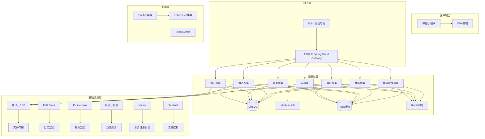
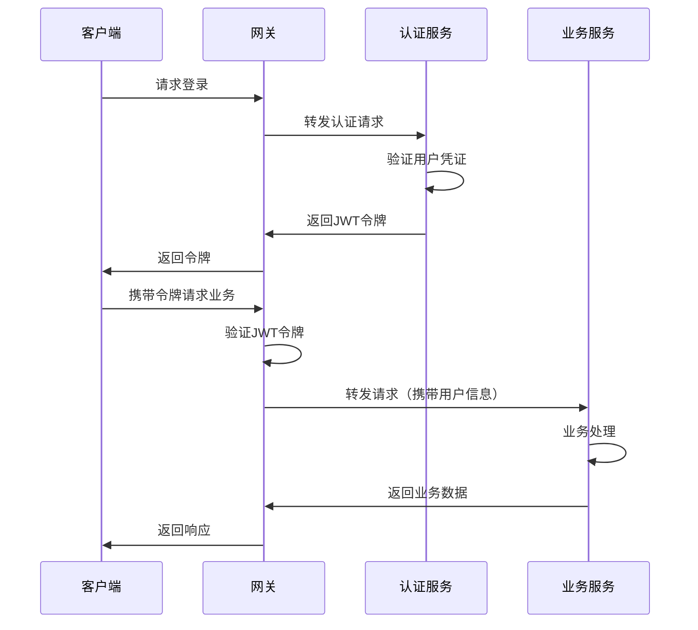

# 肇庆旅游小程序系统架构设计文档

## 文档概述
本文档基于用户指定的技术栈（Java Spring生态、MySQL、Redis、RabbitMQ、腾讯云COS、MiniMax API、Docker + Nginx、RESTful API）设计肇庆旅游小程序后端系统架构。系统采用微服务架构，支持高并发、高可用、可扩展的业务需求。

## 架构设计原则
1. **微服务化**：按业务领域拆分服务，独立开发、部署、扩展
2. **前后端分离**：RESTful API接口，前端独立部署
3. **高可用**：多实例部署、负载均衡、故障自动转移
4. **可扩展**：水平扩展能力，支持业务增长
5. **安全性**：多层次安全防护，数据加密传输
6. **可观测性**：完善的监控、日志、告警体系

## 系统架构图



## 技术栈详细设计

### 1. Spring生态体系
#### 核心框架
- **Spring Boot 3.x**：快速应用开发框架
- **Spring Cloud Alibaba 2023.x**：微服务治理框架（基于Spring Cloud标准）
- **Spring Security**：安全认证授权
- **Spring Data JPA**：数据持久层
- **Spring Cache**：缓存抽象层
- **Spring AMQP**：消息队列集成

#### 微服务组件
- **Spring Cloud Gateway**：API网关，路由、限流、熔断
- **Nacos**：服务注册与发现、分布式配置中心
- **Sentinel**：流量控制、熔断降级、系统自适应保护
- **Spring Cloud OpenFeign**：服务间HTTP调用
- **Spring Cloud Sleuth + Zipkin**：分布式链路追踪（或使用SkyWalking）
- **Seata**：分布式事务解决方案（可选）

#### Nacos详细设计
- **服务注册与发现**：微服务自动注册到Nacos Server，客户端通过服务名调用
- **配置管理**：统一配置中心，支持动态配置更新，多环境配置隔离
- **集群模式**：Nacos集群部署，保证高可用，数据持久化到MySQL
- **健康检查**：主动健康检查，自动剔除不健康实例
- **命名空间**：多租户隔离，支持开发、测试、生产环境分离

#### Sentinel详细设计
- **流量控制**：QPS/线程数限流，支持集群限流模式
- **熔断降级**：慢调用比例、异常比例、异常数熔断策略
- **系统保护**：自适应系统负载保护，防止雪崩效应
- **热点参数限流**：针对热点参数进行精细化的流量控制
- **规则持久化**：规则配置持久化到Nacos，支持动态规则推送
- **监控仪表板**：实时监控流量、熔断、系统负载等指标

#### 配置示例
**Nacos客户端配置 (application.yml)**:
```yaml
spring:
  application:
    name: user-service
  cloud:
    nacos:
      discovery:
        server-addr: 127.0.0.1:8848
        namespace: dev
        group: DEFAULT_GROUP
      config:
        server-addr: 127.0.0.1:8848
        file-extension: yaml
        namespace: dev
        group: DEFAULT_GROUP
        refresh-enabled: true

server:
  port: 8001

management:
  endpoints:
    web:
      exposure:
        include: health,info,metrics
```

**Sentinel配置 (application-sentinel.yml)**:
```yaml
spring:
  cloud:
    sentinel:
      transport:
        dashboard: 127.0.0.1:8080
        port: 8719
      eager: true
      datasource:
        ds1:
          nacos:
            server-addr: 127.0.0.1:8848
            dataId: ${spring.application.name}-sentinel
            groupId: DEFAULT_GROUP
            rule-type: flow
```

### 2. 数据存储层
#### MySQL数据库设计
- **主从复制**：一主多从，读写分离
- **分库分表**：按业务垂直拆分，按数据量水平拆分
- **连接池**：HikariCP高性能连接池
- **ORM框架**：MyBatis Plus增强功能

#### Redis缓存设计
- **缓存策略**：多级缓存，本地缓存+Redis分布式缓存
- **数据结构**：
  - String：用户会话、配置信息
  - Hash：用户信息、商品信息
  - List：消息队列、最新列表
  - Set：用户标签、好友关系
  - Sorted Set：排行榜、热门内容
- **持久化**：RDB+AOF混合持久化
- **集群模式**：Redis Cluster分片集群

### 3. 消息队列 - RabbitMQ
#### 消息队列设计
- **交换机类型**：
  - Direct：精确路由
  - Topic：模式匹配路由
  - Fanout：广播
  - Headers：头部匹配路由
- **队列设计**：
  - 订单队列：订单创建、支付通知
  - 通知队列：系统通知、短信推送
  - 日志队列：操作日志、行为日志
  - 数据同步队列：缓存更新、数据同步
- **可靠性**：消息确认机制、持久化、死信队列

### 4. 文件存储 - 腾讯云COS
#### 存储架构
1. **Bucket规划**：
   - `zq-travel-images`：图片存储（景点、商品、食谱）
   - `zq-travel-audios`：音频存储（音乐、自然声音）
   - `zq-travel-avatars`：用户头像
   - `zq-travel-backup`：数据备份

2. **访问策略**：
   - 公共读私有写
   - CDN加速静态资源
   - 防盗链设置
   - 生命周期管理

3. **上传流程**：
   - 前端获取临时上传凭证
   - 直传COS，减轻服务器压力
   - 上传回调验证

### 5. AI集成 - MiniMax API
#### 集成架构
1. **代理服务设计**：
   - AI服务作为独立微服务
   - 请求转发、结果缓存、限流控制
   - 对话历史存储到MySQL

2. **多Agent支持**：
   - 肇庆小助手：旅游问答
   - 行程规划师：路线规划
   - 心灵疗愈师：情绪陪伴

3. **优化策略**：
   - 请求合并，减少API调用
   - 结果缓存，提高响应速度
   - 异步处理，提升用户体验

### 6. API网关 - Nginx + Spring Cloud Gateway
#### 网关架构
1. **Nginx层**：
   - SSL/TLS终止
   - 静态资源服务
   - 负载均衡（轮询、权重、IP哈希）
   - 限流（漏桶算法）

2. **Spring Cloud Gateway层**：
   - 动态路由
   - 认证鉴权（JWT验证）
   - 请求限流
   - 熔断降级
   - 请求/响应修改
   - 监控指标

### 7. 容器化部署 - Docker
#### 容器设计
1. **基础镜像**：
   - `openjdk:17-jdk-slim`：Java应用
   - `nginx:alpine`：Nginx网关
   - `mysql:8.0`：数据库
   - `redis:7-alpine`：缓存
   - `rabbitmq:3-management`：消息队列

2. **Dockerfile规范**：
   - 多阶段构建，减小镜像体积
   - 非root用户运行
   - 健康检查配置
   - 资源限制设置

### 8. 服务拆分设计
#### 微服务划分
| 服务名称 | 职责 | 端口 | 数据库 | 缓存 | 消息队列 |
|---------|------|------|--------|------|----------|
| 用户服务 | 用户管理、认证授权 | 8001 | users, auth | 用户会话 | 登录日志 |
| 景点服务 | 景点信息、收藏推荐 | 8002 | scenic_spots | 景点缓存 | 推荐更新 |
| 音乐服务 | 音乐管理、播放统计 | 8003 | musics, playlists | 音乐缓存 | 播放记录 |
| 食谱服务 | 食谱管理、烹饪记录 | 8004 | recipes | 食谱缓存 | 烹饪日志 |
| 商店服务 | 商品管理、订单支付 | 8005 | products, orders | 商品缓存 | 订单队列 |
| 健康服务 | 健康数据、运动统计 | 8006 | health_data | 实时数据 | 数据同步 |
| AI服务 | AI对话、行程规划 | 8007 | ai_conversations | 对话缓存 | 异步处理 |
| 搜索服务 | 全局搜索、建议推荐 | 8008 | search_history | 搜索缓存 | 索引更新 |
| 文件服务 | 文件上传、存储管理 | 8009 | - | 上传令牌 | 文件处理 |

## 数据库设计

### 核心表结构
```sql
-- 用户表
CREATE TABLE users (
    id BIGINT PRIMARY KEY AUTO_INCREMENT,
    openid VARCHAR(128) UNIQUE COMMENT '微信OpenID',
    phone VARCHAR(20) COMMENT '手机号',
    nickname VARCHAR(100) COMMENT '昵称',
    avatar_url VARCHAR(500) COMMENT '头像URL',
    gender TINYINT COMMENT '性别 0-未知 1-男 2-女',
    created_at DATETIME DEFAULT CURRENT_TIMESTAMP,
    updated_at DATETIME DEFAULT CURRENT_TIMESTAMP ON UPDATE CURRENT_TIMESTAMP,
    INDEX idx_openid (openid),
    INDEX idx_phone (phone)
) ENGINE=InnoDB DEFAULT CHARSET=utf8mb4 COMMENT='用户表';

-- 景点表
CREATE TABLE scenic_spots (
    id BIGINT PRIMARY KEY AUTO_INCREMENT,
    name VARCHAR(200) NOT NULL COMMENT '景点名称',
    category VARCHAR(50) COMMENT '分类',
    hero_image VARCHAR(500) COMMENT '主图URL',
    images JSON COMMENT '图片列表',
    aqi INT COMMENT '空气质量指数',
    temperature DECIMAL(4,1) COMMENT '温度',
    humidity DECIMAL(4,1) COMMENT '湿度',
    quote VARCHAR(500) COMMENT '引用语',
    description TEXT COMMENT '描述',
    description_secondary TEXT COMMENT '次要描述',
    open_time VARCHAR(100) COMMENT '开放时间',
    difficulty VARCHAR(50) COMMENT '难度',
    distance VARCHAR(100) COMMENT '距离',
    location JSON COMMENT '地理位置',
    created_at DATETIME DEFAULT CURRENT_TIMESTAMP,
    updated_at DATETIME DEFAULT CURRENT_TIMESTAMP ON UPDATE CURRENT_TIMESTAMP,
    INDEX idx_category (category),
    FULLTEXT idx_search (name, description)
) ENGINE=InnoDB DEFAULT CHARSET=utf8mb4 COMMENT='景点表';

-- 音乐表
CREATE TABLE musics (
    id BIGINT PRIMARY KEY AUTO_INCREMENT,
    name VARCHAR(200) NOT NULL COMMENT '音乐名称',
    artist VARCHAR(100) COMMENT '艺术家',
    emoji VARCHAR(10) COMMENT '表情符号',
    tag VARCHAR(50) COMMENT '标签',
    duration INT COMMENT '时长(秒)',
    image_url VARCHAR(500) COMMENT '封面图URL',
    audio_url VARCHAR(500) COMMENT '音频文件URL',
    category VARCHAR(50) COMMENT '分类',
    play_count INT DEFAULT 0 COMMENT '播放次数',
    favorite_count INT DEFAULT 0 COMMENT '收藏次数',
    created_at DATETIME DEFAULT CURRENT_TIMESTAMP,
    INDEX idx_category (category),
    INDEX idx_popularity (play_count, favorite_count)
) ENGINE=InnoDB DEFAULT CHARSET=utf8mb4 COMMENT='音乐表';

-- 完整表结构见附录
```

## API架构设计

### RESTful API规范
1. **URL设计**：
   - 资源使用名词复数：`/api/v1/users`
   - 操作使用HTTP方法：GET获取、POST创建、PUT更新、DELETE删除
   - 版本控制：URL路径包含版本号 `/api/v1/`

2. **响应格式**：
```json
{
  "code": 200,
  "message": "success",
  "data": {},
  "timestamp": 1746451200
}
```

3. **错误处理**：
```json
{
  "code": 40001,
  "message": "参数验证失败",
  "errors": [
    {"field": "phone", "message": "手机号格式不正确"}
  ],
  "timestamp": 1746451200
}
```

### API网关路由配置
```yaml
spring:
  cloud:
    gateway:
      routes:
        - id: user-service
          uri: lb://user-service
          predicates:
            - Path=/api/v1/auth/**, /api/v1/users/**
          filters:
            - StripPrefix=1
            - name: RequestRateLimiter
              args:
                redis-rate-limiter.replenishRate: 10
                redis-rate-limiter.burstCapacity: 20
        
        - id: scenic-service
          uri: lb://scenic-service
          predicates:
            - Path=/api/v1/scenic/**, /api/v1/home/**
          filters:
            - StripPrefix=1
```

## 部署架构

### 容器编排 - Docker Compose（开发环境）
```yaml
version: '3.8'
services:
  mysql:
    image: mysql:8.0
    environment:
      MYSQL_ROOT_PASSWORD: root123
      MYSQL_DATABASE: zq_travel
    ports:
      - "3306:3306"
    volumes:
      - mysql_data:/var/lib/mysql
    networks:
      - travel-network

  redis:
    image: redis:7-alpine
    ports:
      - "6379:6379"
    volumes:
      - redis_data:/data
    networks:
      - travel-network

  rabbitmq:
    image: rabbitmq:3-management
    ports:
      - "5672:5672"
      - "15672:15672"
    environment:
      RABBITMQ_DEFAULT_USER: admin
      RABBITMQ_DEFAULT_PASS: admin123
    networks:
      - travel-network

  nginx:
    image: nginx:alpine
    ports:
      - "80:80"
      - "443:443"
    volumes:
      - ./nginx.conf:/etc/nginx/nginx.conf
      - ./ssl:/etc/nginx/ssl
    depends_on:
      - user-service
      - scenic-service
    networks:
      - travel-network

  # 微服务容器定义...
```

### 生产环境架构
1. **Kubernetes集群**：
   - Master节点：3台（高可用）
   - Worker节点：根据业务负载动态扩展
   - Ingress Controller：Nginx Ingress
   - Service Mesh：可选Istio

2. **数据库高可用**：
   - MySQL主从复制 + MHA自动故障转移
   - Redis Cluster集群模式
   - 定期备份到COS

3. **监控体系**：
   - 应用监控：Spring Boot Actuator + Prometheus + Grafana
   - 日志收集：ELK Stack（Elasticsearch + Logstash + Kibana）
   - 链路追踪：Zipkin + SkyWalking
   - 告警系统：AlertManager + 企业微信/钉钉通知

## 安全设计

### 多层次安全防护
1. **网络安全**：
   - VPC私有网络隔离
   - 安全组规则限制
   - DDoS防护

2. **应用安全**：
   - JWT令牌认证
   - 接口权限控制（RBAC）
   - 参数校验和SQL注入防护
   - XSS和CSRF防护

3. **数据安全**：
   - 敏感数据加密存储
   - HTTPS传输加密
   - 数据脱敏处理
   - 访问日志审计

### 认证授权流程


## 性能优化策略

### 缓存策略
1. **多级缓存**：
   - 本地缓存（Caffeine）：高频访问数据
   - Redis缓存：分布式共享数据
   - 数据库缓存：查询结果缓存

2. **缓存更新**：
   - 写操作更新缓存
   - 缓存失效策略（TTL）
   - 缓存穿透、雪崩、击穿防护

### 数据库优化
1. **索引优化**：
   - 联合索引覆盖查询
   - 前缀索引优化
   - 定期分析慢查询

2. **查询优化**：
   - 分页查询优化
   - 避免SELECT *
   - 合理使用JOIN

### 异步处理
1. **消息队列解耦**：
   - 耗时操作异步化
   - 流量削峰填谷
   - 服务解耦

2. **异步响应**：
   - 长任务返回任务ID
   - WebSocket推送结果
   - 轮询查询进度

## 容灾与高可用

### 故障转移策略
1. **服务层**：
   - 多实例部署
   - 健康检查
   - 自动故障转移

2. **数据层**：
   - 数据库主从切换
   - Redis哨兵模式
   - 数据定期备份

3. **网络层**：
   - 多可用区部署
   - CDN加速
   - DNS故障转移

### 降级策略
1. **服务降级**：
   - 非核心功能降级
   - 缓存降级（返回缓存数据）
   - 限流降级（保护核心服务）

2. **功能降级**：
   - AI服务不可用时，返回静态内容
   - 支付服务不可用，引导线下支付
   - 搜索服务不可用，返回默认推荐

## 监控与运维

### 监控指标
1. **基础设施监控**：
   - CPU、内存、磁盘、网络
   - 容器资源使用率

2. **应用监控**：
   - JVM指标（堆内存、GC、线程）
   - 请求量、响应时间、错误率
   - 数据库连接池、缓存命中率

3. **业务监控**：
   - 用户注册、登录、活跃度
   - 订单量、支付成功率
   - 内容访问量、收藏量

### 告警规则
1. **紧急告警**：
   - 服务不可用
   - 数据库连接失败
   - 磁盘空间不足

2. **重要告警**：
   - 响应时间超过阈值
   - 错误率升高
   - 缓存命中率下降

3. **警告告警**：
   - 资源使用率过高
   - 慢查询增多
   - 队列积压

## 附录

### 技术栈版本建议
- **Java**: OpenJDK 17
- **Spring Boot**: 3.2.x
- **Spring Cloud Alibaba**: 2023.0.1.0 (基于Spring Cloud 2023.0.x)
- **MySQL**: 8.0.x
- **Redis**: 7.2.x
- **RabbitMQ**: 3.12.x
- **Nginx**: 1.24.x
- **Docker**: 24.x
- **Kubernetes**: 1.28.x

### 开发环境配置
```bash
# 环境变量配置
export JAVA_HOME=/usr/lib/jvm/java-17-openjdk
export MAVEN_HOME=/usr/share/maven
export PATH=$PATH:$JAVA_HOME/bin:$MAVEN_HOME/bin

# Docker Compose启动
docker-compose up -d mysql redis rabbitmq
```

### 部署检查清单
1. [ ] 代码编译通过
2. [ ] 单元测试通过
3. [ ] 集成测试通过
4. [ ] 性能测试通过
5. [ ] 安全扫描通过
6. [ ] 配置文件检查
7. [ ] 数据库迁移脚本
8. [ ] 监控告警配置
9. [ ] 备份恢复验证
10. [ ] 回滚方案准备

---
*文档版本: 1.1*
*最后更新: 2026-05-05*
*技术栈: Java Spring Cloud Alibaba生态 + MySQL + Redis + RabbitMQ + 腾讯云COS + MiniMax API + Docker + Nginx*