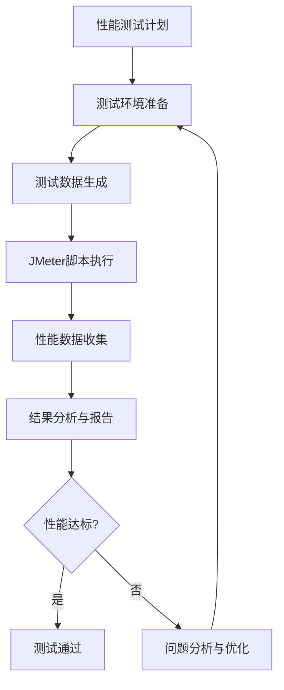

# 肇庆旅游小程序后端功能接口测试文档

## 文档概述

本文档是肇庆旅游小程序后端系统的测试规范文档，基于系统架构设计文档（AGENTS.md）和接口清单文档（backend_api_interfaces.md）制定。旨在规范测试流程，保证接口质量，提高测试效率，确保系统稳定性和可靠性。

## 1. 测试策略与原则

### 1.1 测试目标
- 确保接口功能正确性、性能稳定性和安全性
- 验证业务逻辑符合需求，数据一致性得到保障
- 提前发现并修复缺陷，降低生产环境风险
- 支持持续集成和持续部署，实现快速反馈

### 1.2 测试原则
- **自动化优先**：尽可能实现测试自动化，提高测试效率
- **分层测试**：采用单元测试、集成测试、端到端测试分层策略
- **持续测试**：在CI/CD流水线中集成自动化测试
- **数据隔离**：测试数据与生产数据严格隔离，测试用例独立
- **安全测试**：将安全测试纳入常规测试流程

### 1.3 测试范围
- 所有RESTful API接口（共79个接口，14个模块）
- 数据库操作和事务管理
- 缓存机制（Redis）
- 消息队列（RabbitMQ）
- 服务间通信（OpenFeign）
- 文件上传和存储（腾讯云COS）
- 安全认证和授权（JWT）
- 性能指标和响应时间

## 2. 测试分层

### 2.1 单元测试（Unit Test）
#### 测试目标
- 测试单个方法或类的功能正确性
- 验证业务逻辑和算法实现
- 确保代码覆盖率达标（核心业务代码80%+）

#### 技术栈
- JUnit 5
- Mockito（模拟依赖）
- AssertJ（断言库）
- JaCoCo（代码覆盖率）

#### 示例代码
```java
@ExtendWith(MockitoExtension.class)
class UserServiceTest {
    
    @Mock
    private UserRepository userRepository;
    
    @InjectMocks
    private UserServiceImpl userService;
    
    @Test
    void getUserById_WhenUserExists_ShouldReturnUser() {
        // Given
        Long userId = 1L;
        User user = new User();
        user.setId(userId);
        user.setName("测试用户");
        user.setPhone("13800138000");
        
        when(userRepository.findById(userId))
            .thenReturn(Optional.of(user));
        
        // When
        UserDTO result = userService.getUserById(userId);
        
        // Then
        assertNotNull(result);
        assertEquals(userId, result.getId());
        assertEquals("测试用户", result.getName());
        assertEquals("13800138000", result.getPhone());
        
        verify(userRepository).findById(userId);
    }
    
    @Test
    void getUserById_WhenUserNotExists_ShouldThrowException() {
        // Given
        Long userId = 999L;
        when(userRepository.findById(userId))
            .thenReturn(Optional.empty());
        
        // When & Then
        assertThrows(BusinessException.class, () -> {
            userService.getUserById(userId);
        });
        
        verify(userRepository).findById(userId);
    }
}
```

#### 单元测试规范
- 测试类名：`被测试类名 + Test`，如`UserServiceTest`
- 测试方法名：`方法名_场景_预期结果`，如`getUserById_WhenUserExists_ShouldReturnUser`
- 使用Given-When-Then模式组织测试代码
- 每个测试用例只测试一个功能点
- 使用Mock隔离外部依赖（数据库、第三方服务等）

### 2.2 集成测试（Integration Test）
#### 测试目标
- 测试多个组件集成后的功能
- 验证数据库操作、API接口、缓存等集成点
- 确保服务间通信正常

#### 技术栈
- Spring Boot Test
- TestContainers（容器化测试依赖）
- MockMvc（Web层测试）
- H2内存数据库（可选）

#### 示例代码
```java
@SpringBootTest
@AutoConfigureMockMvc
@Transactional
class UserControllerIntegrationTest {
    
    @Autowired
    private MockMvc mockMvc;
    
    @Autowired
    private UserRepository userRepository;
    
    @Test
    void getUser_WhenUserExists_ShouldReturnUser() throws Exception {
        // Given
        User user = new User();
        user.setName("集成测试用户");
        user.setPhone("13800138001");
        user.setAvatarUrl("https://example.com/avatar.jpg");
        user = userRepository.save(user);
        
        // When & Then
        mockMvc.perform(get("/api/v1/users/{id}", user.getId())
                .contentType(MediaType.APPLICATION_JSON)
                .header("Authorization", "Bearer valid-jwt-token"))
                .andExpect(status().isOk())
                .andExpect(jsonPath("$.code").value(200))
                .andExpect(jsonPath("$.data.id").value(user.getId()))
                .andExpect(jsonPath("$.data.name").value("集成测试用户"))
                .andExpect(jsonPath("$.data.phone").value("13800138001"));
    }
    
    @Test
    void getUser_WhenUserNotExists_ShouldReturnNotFound() throws Exception {
        // When & Then
        mockMvc.perform(get("/api/v1/users/999999")
                .contentType(MediaType.APPLICATION_JSON)
                .header("Authorization", "Bearer valid-jwt-token"))
                .andExpect(status().isNotFound())
                .andExpect(jsonPath("$.code").value(40401))
                .andExpect(jsonPath("$.message").value("用户不存在"));
    }
}
```

#### 集成测试规范
- 测试类名：`被测试类名 + IntegrationTest`
- 使用`@SpringBootTest`加载完整Spring上下文
- 测试数据库使用独立的测试数据库
- 每个测试用例结束后清理测试数据（使用`@Transactional`或手动清理）
- 模拟外部依赖（如第三方API）使用WireMock或MockServer

### 2.3 端到端测试（E2E Test）
#### 测试目标
- 测试完整业务流程，模拟真实用户操作
- 验证多个微服务协同工作
- 确保系统整体功能符合需求

#### 技术栈
- TestContainers（启动完整依赖栈）
- RestAssured（API测试）
- Cucumber（行为驱动开发，可选）
- Selenium（前端集成，可选）

#### 示例场景：用户注册并浏览景点
```java
@Testcontainers
class UserRegistrationE2ETest {
    
    @Container
    static MySQLContainer<?> mysql = new MySQLContainer<>("mysql:8.0")
            .withDatabaseName("zq_travel_test")
            .withUsername("test")
            .withPassword("test");
    
    @Container
    static RedisContainer<?> redis = new RedisContainer<>("redis:7.2")
            .withExposedPorts(6379);
    
    @Test
    void userCanRegisterAndBrowseScenicSpots() {
        // 1. 用户注册
        String registerResponse = given()
                .baseUri("http://localhost:8080")
                .contentType(ContentType.JSON)
                .body("{\"phone\": \"13800138002\", \"password\": \"123456\"}")
                .when()
                .post("/api/v1/auth/register")
                .then()
                .statusCode(200)
                .extract()
                .path("data.accessToken");
        
        String accessToken = registerResponse;
        
        // 2. 获取首页推荐
        given()
                .baseUri("http://localhost:8080")
                .header("Authorization", "Bearer " + accessToken)
                .when()
                .get("/api/v1/home/recommends")
                .then()
                .statusCode(200)
                .body("code", equalTo(200))
                .body("data", hasSize(greaterThan(0)));
        
        // 3. 浏览景点列表
        given()
                .baseUri("http://localhost:8080")
                .header("Authorization", "Bearer " + accessToken)
                .queryParam("page", 1)
                .queryParam("size", 10)
                .when()
                .get("/api/v1/scenic/spots")
                .then()
                .statusCode(200)
                .body("code", equalTo(200))
                .body("data.list", hasSize(lessThanOrEqualTo(10)));
    }
}
```

#### 端到端测试规范
- 测试类名：`业务场景 + E2ETest`
- 使用TestContainers启动所有依赖服务（MySQL、Redis、RabbitMQ等）
- 模拟真实用户操作流程
- 测试数据完全隔离，不影响其他环境
- 测试完成后清理所有资源

## 3. 测试环境

### 3.1 环境划分
| 环境 | 用途 | 数据库 | 配置 |
|------|------|--------|------|
| **开发环境（dev）** | 开发人员本地测试 | 本地MySQL/容器 | 本地配置 |
| **测试环境（test）** | 集成测试、自动化测试 | 独立测试数据库 | 测试专用配置 |
| **预发布环境（staging）** | 用户验收测试、性能测试 | 准生产数据库 | 生产相似配置 |
| **生产环境（prod）** | 线上运行 | 生产数据库 | 生产配置 |

### 3.2 环境配置
```yaml
# application-test.yml
spring:
  datasource:
    url: jdbc:mysql://localhost:3306/zq_travel_test?useUnicode=true&characterEncoding=utf8&useSSL=false
    username: test_user
    password: test_password
  redis:
    host: localhost
    port: 6379
    database: 1
  rabbitmq:
    host: localhost
    port: 5672
    username: guest
    password: guest
    
# 测试专用配置
test:
  mock:
    third-party: true  # 模拟第三方服务
  data:
    reset-before-test: true  # 测试前重置数据
```

## 4. 测试工具与框架

### 4.1 主要测试工具
| 工具 | 用途 | 版本 |
|------|------|------|
| JUnit 5 | 单元测试框架 | 5.10+ |
| Mockito | 模拟框架 | 5.7+ |
| AssertJ | 断言库 | 3.24+ |
| Spring Boot Test | Spring集成测试 | 3.2+ |
| TestContainers | 容器化测试 | 1.19+ |
| RestAssured | API测试 | 5.4+ |
| JaCoCo | 代码覆盖率 | 0.8.11+ |
| JMeter | 性能测试 | 5.6+ |
| OWASP ZAP | 安全测试 | 2.14+ |

### 4.2 测试框架集成
```xml
<!-- pom.xml 测试依赖 -->
<dependencies>
    <!-- 单元测试 -->
    <dependency>
        <groupId>org.junit.jupiter</groupId>
        <artifactId>junit-jupiter</artifactId>
        <scope>test</scope>
    </dependency>
    <dependency>
        <groupId>org.mockito</groupId>
        <artifactId>mockito-core</artifactId>
        <scope>test</scope>
    </dependency>
    <dependency>
        <groupId>org.mockito</groupId>
        <artifactId>mockito-junit-jupiter</artifactId>
        <scope>test</scope>
    </dependency>
    <dependency>
        <groupId>org.assertj</groupId>
        <artifactId>assertj-core</artifactId>
        <scope>test</scope>
    </dependency>
    
    <!-- 集成测试 -->
    <dependency>
        <groupId>org.springframework.boot</groupId>
        <artifactId>spring-boot-starter-test</artifactId>
        <scope>test</scope>
    </dependency>
    
    <!-- 端到端测试 -->
    <dependency>
        <groupId>org.testcontainers</groupId>
        <artifactId>testcontainers</artifactId>
        <scope>test</scope>
    </dependency>
    <dependency>
        <groupId>org.testcontainers</groupId>
        <artifactId>mysql</artifactId>
        <scope>test</scope>
    </dependency>
    <dependency>
        <groupId>org.testcontainers</groupId>
        <artifactId>junit-jupiter</artifactId>
        <scope>test</scope>
    </dependency>
    <dependency>
        <groupId>io.rest-assured</groupId>
        <artifactId>rest-assured</artifactId>
        <scope>test</scope>
    </dependency>
    
    <!-- 代码覆盖率 -->
    <dependency>
        <groupId>org.jacoco</groupId>
        <artifactId>jacoco-maven-plugin</artifactId>
        <version>0.8.11</version>
    </dependency>
</dependencies>
```

## 5. 测试数据管理

### 5.1 测试数据策略
- **独立数据库**：测试环境使用独立的数据库实例
- **数据初始化**：使用Flyway或Liquibase管理测试数据脚本
- **数据隔离**：每个测试用例使用独立的数据集，避免相互影响
- **数据清理**：测试完成后自动清理测试数据

### 5.2 测试数据准备
```sql
-- test-data.sql
-- 用户测试数据
INSERT INTO users (id, openid, phone, nickname, avatar_url, gender, created_at, is_deleted) 
VALUES 
(1001, 'test_openid_1', '13800138001', '测试用户1', 'https://example.com/avatar1.jpg', 1, NOW(), 0),
(1002, 'test_openid_2', '13800138002', '测试用户2', 'https://example.com/avatar2.jpg', 2, NOW(), 0),
(1003, 'test_openid_3', '13800138003', '测试用户3', 'https://example.com/avatar3.jpg', 0, NOW(), 0);

-- 景点测试数据
INSERT INTO scenic_spots (id, name, description, location, latitude, longitude, cover_image, rating, created_at, is_deleted)
VALUES
(2001, '七星岩', '肇庆著名景点，以七座石灰岩峰排列状如北斗七星而得名', '肇庆市端州区', 23.052, 112.465, 'https://example.com/qixingyan.jpg', 4.8, NOW(), 0),
(2002, '鼎湖山', '岭南四大名山之一，被誉为"北回归线上的绿宝石"', '肇庆市鼎湖区', 23.167, 112.567, 'https://example.com/dinghushan.jpg', 4.7, NOW(), 0);

-- 商品测试数据
INSERT INTO products (id, name, description, price, stock, category_id, cover_image, created_at, is_deleted)
VALUES
(3001, '肇庆裹蒸粽', '肇庆传统美食，用糯米、绿豆、猪肉等原料制作', 25.00, 100, 1, 'https://example.com/zongzi.jpg', NOW(), 0),
(3002, '端砚', '中国四大名砚之一，肇庆特产', 150.00, 50, 2, 'https://example.com/duanyan.jpg', NOW(), 0);
```

### 5.3 测试数据工厂
```java
// 使用TestDataFactory生成测试数据
public class TestDataFactory {
    
    public static User createUser(Long id) {
        User user = new User();
        user.setId(id);
        user.setOpenid("test_openid_" + id);
        user.setPhone("13800138" + String.format("%03d", id));
        user.setNickname("测试用户" + id);
        user.setAvatarUrl("https://example.com/avatar" + id + ".jpg");
        user.setGender(id % 3);
        user.setCreatedAt(LocalDateTime.now());
        user.setIsDeleted(0);
        return user;
    }
    
    public static ScenicSpot createScenicSpot(Long id) {
        ScenicSpot spot = new ScenicSpot();
        spot.setId(id);
        spot.setName("测试景点" + id);
        spot.setDescription("测试景点描述" + id);
        spot.setLocation("测试地点" + id);
        spot.setLatitude(23.0 + id * 0.01);
        spot.setLongitude(112.0 + id * 0.01);
        spot.setCoverImage("https://example.com/spot" + id + ".jpg");
        spot.setRating(4.5);
        spot.setCreatedAt(LocalDateTime.now());
        spot.setIsDeleted(0);
        return spot;
    }
}
```

## 6. 性能测试

### 6.1 性能测试目标
- 验证接口响应时间满足要求（P95 < 200ms）
- 测试系统在高并发下的稳定性
- 确定系统容量和瓶颈点
- 评估系统可扩展性

### 6.2 性能测试指标
| 指标 | 要求 | 测量方法 |
|------|------|----------|
| 响应时间（P95） | < 200ms | JMeter聚合报告 |
| 吞吐量（TPS） | > 100 req/s | JMeter吞吐量监听器 |
| 错误率 | < 0.1% | JMeter错误率统计 |
| 并发用户数 | 支持1000+ | 逐步增加并发测试 |
| CPU使用率 | < 70% | 系统监控工具 |
| 内存使用率 | < 80% | 系统监控工具 |

### 6.3 JMeter测试计划示例
```xml
<?xml version="1.0" encoding="UTF-8"?>
<jmeterTestPlan version="1.2" properties="5.0" jmeter="5.6">
  <hashTree>
    <TestPlan guiclass="TestPlanGui" testclass="TestPlan" testname="肇庆旅游API性能测试" enabled="true">
      <stringProp name="TestPlan.comments">肇庆旅游小程序API性能测试计划</stringProp>
      <boolProp name="TestPlan.functional_mode">false</boolProp>
      <boolProp name="TestPlan.tearDown_on_shutdown">true</boolProp>
      <boolProp name="TestPlan.serialize_threadgroups">false</boolProp>
      <elementProp name="TestPlan.user_defined_variables" elementType="Arguments" guiclass="ArgumentsPanel" testclass="Arguments" testname="用户定义的变量" enabled="true">
        <collectionProp name="Arguments.arguments">
          <elementProp name="base_url" elementType="Argument">
            <stringProp name="Argument.name">base_url</stringProp>
            <stringProp name="Argument.value">http://localhost:8080</stringProp>
            <stringProp name="Argument.metadata">=</stringProp>
          </elementProp>
          <elementProp name="access_token" elementType="Argument">
            <stringProp name="Argument.name">access_token</stringProp>
            <stringProp name="Argument.value">${__getTestToken()}</stringProp>
            <stringProp name="Argument.metadata">=</stringProp>
          </elementProp>
        </collectionProp>
      </elementProp>
    </TestPlan>
    <hashTree>
      <ThreadGroup guiclass="ThreadGroupGui" testclass="ThreadGroup" testname="用户登录性能测试" enabled="true">
        <stringProp name="ThreadGroup.on_sample_error">continue</stringProp>
        <elementProp name="ThreadGroup.main_controller" elementType="LoopController" guiclass="LoopControlPanel" testclass="LoopController" testname="循环控制器" enabled="true">
          <boolProp name="LoopController.continue_forever">false</boolProp>
          <intProp name="LoopController.loops">1</intProp>
        </elementProp>
        <stringProp name="ThreadGroup.num_threads">100</stringProp>
        <stringProp name="ThreadGroup.ramp_time">30</stringProp>
        <boolProp name="ThreadGroup.scheduler">false</boolProp>
        <stringProp name="ThreadGroup.duration"></stringProp>
        <stringProp name="ThreadGroup.delay"></stringProp>
        <boolProp name="ThreadGroup.same_user_on_next_iteration">true</boolProp>
      </ThreadGroup>
      <hashTree>
        <HTTPSamplerProxy guiclass="HttpTestSampleGui" testclass="HTTPSamplerProxy" testname="用户登录接口" enabled="true">
          <elementProp name="HTTPsampler.Arguments" elementType="Arguments" guiclass="HTTPArgumentsPanel" testclass="Arguments" testname="用户定义的变量" enabled="true">
            <collectionProp name="Arguments.arguments">
              <elementProp name="phone" elementType="Argument">
                <stringProp name="Argument.name">phone</stringProp>
                <stringProp name="Argument.value">13800138${__Random(100,999)}</stringProp>
                <stringProp name="Argument.metadata">=</stringProp>
              </elementProp>
              <elementProp name="password" elementType="Argument">
                <stringProp name="Argument.name">password</stringProp>
                <stringProp name="Argument.value">123456</stringProp>
                <stringProp name="Argument.metadata">=</stringProp>
              </elementProp>
            </collectionProp>
          </elementProp>
          <stringProp name="HTTPSampler.domain">localhost</stringProp>
          <stringProp name="HTTPSampler.port">8080</stringProp>
          <stringProp name="HTTPSampler.protocol">http</stringProp>
          <stringProp name="HTTPSampler.contentEncoding"></stringProp>
          <stringProp name="HTTPSampler.path">/api/v1/auth/login</stringProp>
          <stringProp name="HTTPSampler.method">POST</stringProp>
          <boolProp name="HTTPSampler.follow_redirects">true</boolProp>
          <boolProp name="HTTPSampler.auto_redirects">false</boolProp>
          <boolProp name="HTTPSampler.use_keepalive">true</boolProp>
          <boolProp name="HTTPSampler.DO_MULTIPART_POST">false</boolProp>
          <stringProp name="HTTPSampler.embedded_url_re"></stringProp>
          <stringProp name="HTTPSampler.connect_timeout"></stringProp>
          <stringProp name="HTTPSampler.response_timeout"></stringProp>
        </HTTPSamplerProxy>
        <hashTree>
          <HeaderManager guiclass="HeaderPanel" testclass="HeaderManager" testname="HTTP头管理器" enabled="true">
            <collectionProp name="HeaderManager.headers">
              <elementProp name="" elementType="Header">
                <stringProp name="Header.name">Content-Type</stringProp>
                <stringProp name="Header.value">application/json</stringProp>
              </elementProp>
            </collectionProp>
          </HeaderManager>
          <hashTree/>
          <ResponseAssertion guiclass="AssertionGui" testclass="ResponseAssertion" testname="响应断言" enabled="true">
            <collectionProp name="Asserion.test_strings">
              <stringProp name="49586">"code":200</stringProp>
            </collectionProp>
            <stringProp name="Assertion.test_field">Assertion.response_data</stringProp>
            <boolProp name="Assertion.assume_success">false</boolProp>
            <intProp name="Assertion.test_type">16</intProp>
          </ResponseAssertion>
          <hashTree/>
        </hashTree>
      </hashTree>
    </hashTree>
  </hashTree>
</jmeterTestPlan>
```

### 6.4 性能测试执行流程


## 7. 安全测试

### 7.1 安全测试范围
- 身份认证和授权测试
- 输入验证和注入攻击防护
- 敏感数据保护
- API安全配置
- 依赖组件安全漏洞

### 7.2 安全测试用例
| 测试类型 | 测试点 | 测试方法 | 预期结果 |
|----------|--------|----------|----------|
| **认证测试** | 未授权访问 | 不带Token访问受保护接口 | 返回401未授权 |
| **授权测试** | 越权访问 | 用户A访问用户B的数据 | 返回403禁止访问 |
| **输入验证** | SQL注入 | 输入SQL注入payload | 返回参数验证错误 |
| **输入验证** | XSS攻击 | 输入XSS脚本 | 输入被过滤或转义 |
| **数据安全** | 敏感信息泄露 | 检查响应中是否包含敏感信息 | 敏感信息被脱敏 |
| **配置安全** | 敏感配置暴露 | 检查actuator端点 | 敏感端点被保护 |

### 7.3 OWASP ZAP安全扫描
```bash
# 启动ZAP安全扫描
docker run -v $(pwd):/zap/wrk -t owasp/zap2docker-stable zap-baseline.py \
  -t http://localhost:8080 \
  -r test-report.html \
  -c zap-config.conf
```

## 8. 接口测试用例示例

### 8.1 用户管理模块测试用例
| 接口 | 测试场景 | 测试步骤 | 预期结果 |
|------|----------|----------|----------|
| `POST /api/v1/auth/register` | 正常注册 | 1. 发送手机号和密码<br>2. 验证响应 | 返回注册成功，包含用户信息和Token |
| `POST /api/v1/auth/register` | 重复注册 | 1. 使用已注册手机号注册<br>2. 验证响应 | 返回错误，提示手机号已存在 |
| `POST /api/v1/auth/register` | 无效参数 | 1. 发送无效手机号<br>2. 验证响应 | 返回参数验证错误 |
| `POST /api/v1/auth/login` | 正常登录 | 1. 发送正确凭据<br>2. 验证响应 | 返回登录成功，包含Token |
| `POST /api/v1/auth/login` | 错误密码 | 1. 发送错误密码<br>2. 验证响应 | 返回认证失败错误 |
| `GET /api/v1/auth/profile` | 获取个人信息 | 1. 使用有效Token<br>2. 验证响应 | 返回用户个人信息 |
| `GET /api/v1/auth/profile` | 无效Token | 1. 使用无效Token<br>2. 验证响应 | 返回401未授权 |

### 8.2 景点管理模块测试用例
| 接口 | 测试场景 | 测试步骤 | 预期结果 |
|------|----------|----------|----------|
| `GET /api/v1/scenic/spots` | 分页查询 | 1. 查询第1页，每页10条<br>2. 验证响应 | 返回10条景点数据，包含分页信息 |
| `GET /api/v1/scenic/spots` | 分类筛选 | 1. 按分类ID筛选<br>2. 验证响应 | 返回指定分类的景点 |
| `GET /api/v1/scenic/spots/:id` | 获取详情 | 1. 查询存在的景点ID<br>2. 验证响应 | 返回景点详细信息 |
| `GET /api/v1/scenic/spots/:id` | 不存在的ID | 1. 查询不存在的景点ID<br>2. 验证响应 | 返回景点不存在错误 |
| `POST /api/v1/scenic/spots/:id/favorite` | 收藏景点 | 1. 收藏一个景点<br>2. 验证响应 | 返回收藏成功 |
| `POST /api/v1/scenic/spots/:id/favorite` | 重复收藏 | 1. 重复收藏同一景点<br>2. 验证响应 | 返回已收藏状态 |
| `GET /api/v1/scenic/favorites` | 获取收藏列表 | 1. 查询用户收藏<br>2. 验证响应 | 返回用户收藏的景点列表 |

### 8.3 AI助手模块测试用例
| 接口 | 测试场景 | 测试步骤 | 预期结果 |
|------|----------|----------|----------|
| `GET /api/v1/ai/agents` | 获取AI代理列表 | 1. 查询AI代理列表<br>2. 验证响应 | 返回AI代理列表（肇庆小助手、行程规划、心灵疗愈） |
| `POST /api/v1/ai/chat` | 发送消息 | 1. 发送消息给AI代理<br>2. 验证响应 | 返回AI回复消息 |
| `POST /api/v1/ai/chat` | 超长消息 | 1. 发送超过限制的消息<br>2. 验证响应 | 返回消息长度超限错误 |
| `GET /api/v1/ai/conversations` | 获取对话历史 | 1. 查询用户对话历史<br>2. 验证响应 | 返回用户与AI的对话记录 |
| `DELETE /api/v1/ai/conversations/:id` | 删除单条对话 | 1. 删除指定对话记录<br>2. 验证响应 | 返回删除成功 |
| `DELETE /api/v1/ai/conversations` | 清空对话历史 | 1. 清空所有对话记录<br>2. 验证响应 | 返回清空成功 |

### 8.4 完整测试用例模板
```java
/**
 * 测试用例：用户注册接口测试
 * 测试ID：TC-USER-001
 * 优先级：高
 * 模块：用户管理
 */
@Nested
@DisplayName("用户注册接口测试")
class UserRegisterTest {
    
    @Test
    @DisplayName("TC-USER-001-001: 正常注册新用户")
    void register_WithValidData_ShouldReturnSuccess() throws Exception {
        // 测试数据
        RegisterRequest request = new RegisterRequest();
        request.setPhone("13800138000");
        request.setPassword("Password123");
        request.setNickname("测试用户");
        
        // 执行测试
        mockMvc.perform(post("/api/v1/auth/register")
                .contentType(MediaType.APPLICATION_JSON)
                .content(objectMapper.writeValueAsString(request)))
                .andExpect(status().isOk())
                .andExpect(jsonPath("$.code").value(200))
                .andExpect(jsonPath("$.data.user.phone").value("13800138000"))
                .andExpect(jsonPath("$.data.accessToken").exists())
                .andExpect(jsonPath("$.data.refreshToken").exists());
        
        // 验证数据库
        User user = userRepository.findByPhone("13800138000");
        assertNotNull(user);
        assertEquals("测试用户", user.getNickname());
    }
    
    @Test
    @DisplayName("TC-USER-001-002: 注册已存在的手机号")
    void register_WithExistingPhone_ShouldReturnError() throws Exception {
        // 准备数据：已存在的用户
        User existingUser = TestDataFactory.createUser(1001L);
        existingUser.setPhone("13800138001");
        userRepository.save(existingUser);
        
        // 测试数据
        RegisterRequest request = new RegisterRequest();
        request.setPhone("13800138001");
        request.setPassword("Password123");
        
        // 执行测试
        mockMvc.perform(post("/api/v1/auth/register")
                .contentType(MediaType.APPLICATION_JSON)
                .content(objectMapper.writeValueAsString(request)))
                .andExpect(status().isBadRequest())
                .andExpect(jsonPath("$.code").value(40001))
                .andExpect(jsonPath("$.message").value("手机号已注册"));
    }
    
    @Test
    @DisplayName("TC-USER-001-003: 注册密码强度不足")
    void register_WithWeakPassword_ShouldReturnError() throws Exception {
        // 测试数据：弱密码
        RegisterRequest request = new RegisterRequest();
        request.setPhone("13800138002");
        request.setPassword("123");  // 密码太短
        
        // 执行测试
        mockMvc.perform(post("/api/v1/auth/register")
                .contentType(MediaType.APPLICATION_JSON)
                .content(objectMapper.writeValueAsString(request)))
                .andExpect(status().isBadRequest())
                .andExpect(jsonPath("$.code").value(40002))
                .andExpect(jsonPath("$.errors[0].field").value("password"))
                .andExpect(jsonPath("$.errors[0].message").value("密码长度6-20位"));
    }
}
```

## 9. 测试执行与报告

### 9.1 测试执行流程
1. **单元测试执行**：每次代码提交时自动执行
2. **集成测试执行**：每日构建时执行，或代码合并到主分支前
3. **端到端测试执行**：版本发布前执行
4. **性能测试执行**：每月执行一次，或重大变更后执行
5. **安全测试执行**：每季度执行一次，或安全漏洞披露后执行

### 9.2 测试报告生成
#### JaCoCo代码覆盖率报告
```xml
<!-- pom.xml JaCoCo配置 -->
<plugin>
    <groupId>org.jacoco</groupId>
    <artifactId>jacoco-maven-plugin</artifactId>
    <version>0.8.11</version>
    <executions>
        <execution>
            <goals>
                <goal>prepare-agent</goal>
            </goals>
        </execution>
        <execution>
            <id>report</id>
            <phase>test</phase>
            <goals>
                <goal>report</goal>
            </goals>
        </execution>
        <execution>
            <id>check</id>
            <phase>verify</phase>
            <goals>
                <goal>check</goal>
            </goals>
            <configuration>
                <rules>
                    <rule>
                        <element>BUNDLE</element>
                        <limits>
                            <limit>
                                <counter>INSTRUCTION</counter>
                                <value>COVEREDRATIO</value>
                                <minimum>0.80</minimum>  <!-- 80%覆盖率要求 -->
                            </limit>
                        </limits>
                    </rule>
                </rules>
            </configuration>
        </execution>
    </executions>
</plugin>
```

#### Allure测试报告
```xml
<!-- pom.xml Allure配置 -->
<plugin>
    <groupId>io.qameta.allure</groupId>
    <artifactId>allure-maven</artifactId>
    <version>2.12.0</version>
</plugin>
```

### 9.3 测试报告示例
```markdown
# 测试报告 - 2026-05-05

## 执行概览
- 测试开始时间: 2026-05-05 10:00:00
- 测试结束时间: 2026-05-05 12:30:00
- 测试环境: test
- 测试人员: 自动化测试系统

## 测试结果统计
| 测试类型 | 总用例数 | 通过数 | 失败数 | 跳过数 | 通过率 |
|----------|----------|--------|--------|--------|--------|
| 单元测试 | 1250 | 1245 | 5 | 0 | 99.6% |
| 集成测试 | 350 | 345 | 5 | 0 | 98.6% |
| 端到端测试 | 50 | 48 | 2 | 0 | 96.0% |
| **总计** | **1650** | **1638** | **12** | **0** | **99.3%** |

## 代码覆盖率
| 模块 | 行覆盖率 | 分支覆盖率 | 方法覆盖率 |
|------|----------|------------|------------|
| user-service | 92% | 88% | 95% |
| scenic-service | 89% | 85% | 92% |
| music-service | 87% | 82% | 90% |
| **平均** | **89.3%** | **85.0%** | **92.3%** |

## 性能测试结果
| 接口 | 平均响应时间(ms) | P95响应时间(ms) | 吞吐量(req/s) | 错误率 |
|------|------------------|-----------------|---------------|--------|
| /api/v1/auth/login | 45 | 89 | 120 | 0% |
| /api/v1/scenic/spots | 68 | 132 | 95 | 0% |
| /api/v1/ai/chat | 210 | 450 | 40 | 0.1% |

## 发现的主要问题
1. **问题ID: BUG-001**
   - 模块: user-service
   - 描述: 用户注册时未校验手机号格式
   - 严重程度: 高
   - 状态: 已修复

2. **问题ID: BUG-002**
   - 模块: scenic-service
   - 描述: 景点分页查询在最后一页返回错误
   - 严重程度: 中
   - 状态: 待修复

## 测试结论
✅ **测试通过** - 所有核心功能测试通过，性能指标达标，可以进入下一阶段。
```

## 10. CI/CD中的测试集成

### 10.1 GitLab CI/CD流水线
```yaml
# .gitlab-ci.yml
stages:
  - build
  - test
  - security-scan
  - deploy

variables:
  MAVEN_OPTS: "-Dmaven.repo.local=.m2/repository"

cache:
  paths:
    - .m2/repository/
    - target/

build:
  stage: build
  image: maven:3.8-openjdk-17
  script:
    - mvn clean compile -DskipTests
  artifacts:
    paths:
      - target/classes/

unit-test:
  stage: test
  image: maven:3.8-openjdk-17
  script:
    - mvn test -Dtest=*Test
  artifacts:
    reports:
      junit:
        - target/surefire-reports/TEST-*.xml
      coverage_report:
        coverage_format: cobertura
        path: target/site/jacoco/jacoco.xml
  coverage: '/Total.*?([0-9]{1,3})%/'

integration-test:
  stage: test
  image: maven:3.8-openjdk-17
  services:
    - mysql:8.0
    - redis:7.2
    - rabbitmq:3.12
  variables:
    MYSQL_ROOT_PASSWORD: root123
    MYSQL_DATABASE: zq_travel_test
    REDIS_HOST: redis
    RABBITMQ_HOST: rabbitmq
  script:
    - mvn test -Dtest=*IntegrationTest -Dspring.profiles.active=test
  artifacts:
    reports:
      junit:
        - target/surefire-reports/TEST-*.xml

security-scan:
  stage: security-scan
  image: owasp/zap2docker-stable
  script:
    - zap-baseline.py -t http://application:8080 -r zap-report.html
  artifacts:
    paths:
      - zap-report.html

performance-test:
  stage: test
  image: justb4/jmeter:5.6
  script:
    - jmeter -n -t performance-test.jmx -l results.jtl -e -o report
  artifacts:
    paths:
      - report/
    reports:
      junit:
        - results.jtl
  only:
    - schedules  # 仅定时执行
```

### 10.2 测试质量门禁
```yaml
# 质量门禁规则
quality_gates:
  unit_test:
    coverage_threshold: 80%  # 单元测试覆盖率必须>=80%
    pass_rate: 95%           # 单元测试通过率必须>=95%
  
  integration_test:
    pass_rate: 90%           # 集成测试通过率必须>=90%
  
  security_test:
    critical_vulnerabilities: 0  # 不能有严重安全漏洞
    high_vulnerabilities: 2      # 高危漏洞不超过2个
  
  performance_test:
    p95_response_time: 200ms     # P95响应时间必须<=200ms
    error_rate: 0.1%             # 错误率必须<=0.1%
```

## 11. 附录

### 11.1 常用测试命令
```bash
# 运行所有测试
mvn test

# 运行单元测试
mvn test -Dtest=*Test

# 运行集成测试
mvn test -Dtest=*IntegrationTest -Dspring.profiles.active=test

# 运行特定模块的测试
mvn test -pl user-service -am

# 生成代码覆盖率报告
mvn jacoco:report

# 查看测试覆盖率
mvn jacoco:check

# 运行性能测试
jmeter -n -t performance-test.jmx -l results.jtl -e -o report

# 运行安全扫描
docker run -v $(pwd):/zap/wrk -t owasp/zap2docker-stable zap-baseline.py -t http://localhost:8080
```

### 11.2 测试数据管理脚本
```bash
#!/bin/bash
# test-data-manager.sh

# 重置测试数据库
reset_test_db() {
    echo "重置测试数据库..."
    mysql -h localhost -u test_user -ptest_password zq_travel_test < scripts/clean-test-data.sql
    mysql -h localhost -u test_user -ptest_password zq_travel_test < scripts/init-test-data.sql
    echo "测试数据库重置完成"
}

# 生成测试数据
generate_test_data() {
    echo "生成测试数据..."
    mvn test-compile exec:java -Dexec.mainClass="com.zqtravel.test.TestDataGenerator" -Dexec.classpathScope=test
    echo "测试数据生成完成"
}

# 导出测试数据
export_test_data() {
    echo "导出测试数据..."
    mysqldump -h localhost -u test_user -ptest_password zq_travel_test > test-data-$(date +%Y%m%d).sql
    echo "测试数据导出完成"
}

case "$1" in
    reset)
        reset_test_db
        ;;
    generate)
        generate_test_data
        ;;
    export)
        export_test_data
        ;;
    *)
        echo "用法: $0 {reset|generate|export}"
        exit 1
        ;;
esac
```

### 11.3 测试环境检查清单
- [ ] 测试数据库已创建并初始化
- [ ] Redis服务已启动并配置正确
- [ ] RabbitMQ服务已启动并配置正确
- [ ] 测试配置文件（application-test.yml）已正确配置
- [ ] 测试数据已准备就绪
- [ ] 第三方服务模拟已设置
- [ ] 测试工具（JMeter、ZAP等）已安装
- [ ] 测试报告目录有写入权限

### 11.4 测试问题跟踪模板
```markdown
## 问题描述
**模块**: [模块名称]
**接口**: [接口路径]
**严重程度**: [高/中/低]
**发现时间**: [YYYY-MM-DD HH:mm:ss]
**测试环境**: [test/staging]

## 复现步骤
1. [步骤1]
2. [步骤2]
3. [步骤3]

## 预期结果
[描述预期结果]

## 实际结果
[描述实际结果]

## 相关日志
```
[粘贴相关日志]
```

## 环境信息
- 操作系统: [OS版本]
- Java版本: [Java版本]
- 数据库: [数据库版本]
- 测试工具: [测试工具版本]

## 附件
[截图、日志文件等]
```

### 11.5 参考文档
- [JUnit 5用户指南](https://junit.org/junit5/docs/current/user-guide/)
- [Mockito文档](https://javadoc.io/doc/org.mockito/mockito-core/latest/index.html)
- [Spring Boot测试文档](https://docs.spring.io/spring-boot/docs/current/reference/html/features.html#features.testing)
- [TestContainers文档](https://www.testcontainers.org/)
- [JMeter用户手册](https://jmeter.apache.org/usermanual/index.html)
- [OWASP ZAP文档](https://www.zaproxy.org/docs/)

---
*文档版本: 1.0*
*最后更新: 2026-05-05*
*基于AGENTS.md和backend_api_interfaces.md制定*

*下一步建议*:
1. 根据本文档创建具体的测试用例实现
2. 配置CI/CD流水线集成自动化测试
3. 建立测试数据管理流程
4. 定期执行性能测试和安全测试
5. 根据测试结果持续优化测试策略

*未来建议*:
1. 考虑引入契约测试（Pact）确保服务间API兼容性
2. 探索AI辅助测试生成，提高测试用例覆盖率
3. 建立测试数据脱敏和隐私保护机制
4. 实现测试环境自动编排和销毁，降低资源成本
5. 建立测试度量体系，量化测试效果和产品质量
