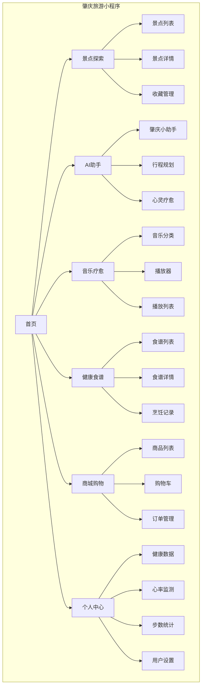
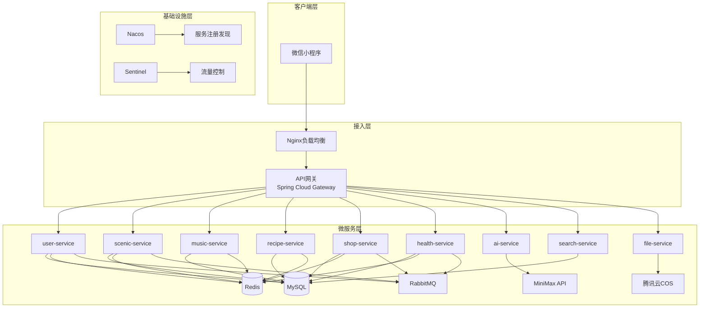

# 肇庆旅游小程序项目需求文档 (PRD)

## 文档信息

| 项目 | 内容 |
|------|------|
| 项目名称 | 肇庆旅游小程序 - 疗愈生活 |
| 文档版本 | 1.0 |
| 创建日期 | 2026-05-05 |
| 最后更新 | 2026-05-05 |
| 文档状态 | 初稿 |

---

## 1. 项目概述

### 1.1 项目背景

肇庆旅游小程序是一个集**景点推荐、音乐疗愈、健康管理、AI助手、电商购物**于一体的综合性旅游服务平台。项目以"疗愈生活"为核心理念，结合肇庆本地旅游资源，为用户提供身心放松、健康管理的全方位旅游体验。

### 1.2 项目目标

1. **为用户提供**：一站式的肇庆旅游服务，包括景点探索、音乐放松、健康食谱、运动健康等功能
2. **为运营方**：建立用户粘性，收集用户行为数据，实现精准推荐和商业化变现
3. **技术目标**：构建高可用、高并发、可扩展的微服务架构系统

### 1.3 目标用户

- **主要用户**：25-45岁的城市白领，注重生活品质和健康
- **次要用户**：旅游爱好者、亲子家庭、老年养生群体
- **用户特征**：追求身心放松、喜欢自然疗愈、关注健康管理

---

## 2. 功能需求

### 2.1 功能架构图



### 2.2 核心功能模块

#### 2.2.1 首页模块

**功能描述**：展示核心入口、推荐内容、快捷操作

**功能列表**：
- 轮播图展示（景点推广、活动宣传）
- 首页推荐列表（个性化推荐）
- 景点推荐卡片
- 快捷操作入口（搜索、AI助手、音乐、食谱）
- 底部导航栏

**用户价值**：快速触达核心功能，发现感兴趣的内容

---

#### 2.2.2 用户管理模块

**功能描述**：用户注册、登录、个人信息管理

**功能列表**：
| 功能 | 描述 | 优先级 |
|------|------|--------|
| 微信登录 | 一键微信授权登录 | P0 |
| 手机号登录 | 短信验证码登录 | P0 |
| 用户注册 | 新用户注册流程 | P0 |
| 个人资料 | 昵称、头像、性别编辑 | P1 |
| 用户登出 | 安全退出登录 | P1 |
| 令牌刷新 | 自动刷新访问令牌 | P1 |

**用户价值**：建立用户身份体系，提供个性化服务基础

---

#### 2.2.3 景点管理模块

**功能描述**：肇庆景点信息展示、收藏、推荐

**功能列表**：
| 功能 | 描述 | 优先级 |
|------|------|--------|
| 景点列表 | 分页展示，支持分类筛选 | P0 |
| 景点详情 | 图片、描述、天气、位置等信息 | P0 |
| 景点分类 | 自然风光、历史文化、休闲娱乐等 | P0 |
| 收藏景点 | 用户收藏喜欢的景点 | P1 |
| 附近景点 | 基于地理位置推荐 | P1 |
| 景点搜索 | 关键词搜索景点 | P1 |

**核心数据**：
- 景点名称、分类、主图、图片集
- 空气质量指数(AQI)、温度、湿度
- 开放时间、难度等级、距离
- 地理位置坐标

**用户价值**：发现和了解肇庆旅游景点，规划出行

---

#### 2.2.4 AI助手模块

**功能描述**：智能对话、行程规划、心灵陪伴

**功能列表**：
| 功能 | 描述 | 优先级 |
|------|------|--------|
| AI代理列表 | 展示可用的AI助手 | P0 |
| 肇庆小助手 | 旅游问答、景点介绍 | P0 |
| 行程规划师 | 个性化旅游路线规划 | P1 |
| 心灵疗愈师 | 情绪陪伴、心理疏导 | P1 |
| 对话历史 | 查看历史对话记录 | P1 |
| 对话管理 | 删除单条/清空历史 | P2 |

**技术实现**：
- 集成MiniMax API
- 请求限流和结果缓存
- 对话历史持久化存储

**用户价值**：智能问答解决旅游疑问，个性化推荐提升体验

---

#### 2.2.5 搜索模块

**功能描述**：全局搜索、搜索建议、历史管理

**功能列表**：
| 功能 | 描述 | 优先级 |
|------|------|--------|
| 全局搜索 | 搜索景点、音乐、食谱、商品 | P0 |
| 搜索历史 | 保存用户搜索记录 | P1 |
| 热门搜索 | 展示热门搜索词 | P1 |
| 搜索建议 | 输入时自动补全建议 | P1 |
| 历史管理 | 删除单条/清空历史 | P2 |

**用户价值**：快速找到感兴趣的内容

---

#### 2.2.6 音乐疗愈模块

**功能描述**：音乐播放、放松疗愈、播放列表管理

**功能列表**：
| 功能 | 描述 | 优先级 |
|------|------|--------|
| 音乐分类 | 推荐、音乐、播客、冥想、助眠 | P0 |
| 放松音乐 | 轻音乐、自然声音 | P0 |
| 冥想音乐 | 冥想引导音频 | P1 |
| 音乐推荐 | 个性化推荐列表 | P1 |
| 播放统计 | 记录播放次数 | P1 |
| 收藏音乐 | 用户收藏喜欢的音乐 | P1 |
| 播放列表 | 创建和管理播放列表 | P2 |
| 歌词展示 | 显示音乐歌词 | P2 |

**核心数据**：
- 音乐名称、艺术家、表情符号、标签
- 时长、封面图、音频文件URL
- 播放次数、收藏次数

**用户价值**：提供音乐放松、冥想助眠的疗愈体验

---

#### 2.2.7 食谱模块

**功能描述**：健康食谱展示、烹饪记录、每日推荐

**功能列表**：
| 功能 | 描述 | 优先级 |
|------|------|--------|
| 食谱列表 | 分页展示，支持分类筛选 | P0 |
| 食谱详情 | 食材、步骤、营养信息 | P0 |
| 食谱分类 | 早餐、午餐、晚餐、养生等 | P0 |
| 收藏食谱 | 用户收藏喜欢的食谱 | P1 |
| 烹饪记录 | 记录用户烹饪完成情况 | P1 |
| 每日推荐 | 每日精选食谱推荐 | P1 |

**用户价值**：提供健康饮食指导，培养健康饮食习惯

---

#### 2.2.8 商城模块

**功能描述**：商品浏览、购物车、订单管理

**功能列表**：
| 功能 | 描述 | 优先级 |
|------|------|--------|
| 商品列表 | 分页展示，支持分类、排序 | P0 |
| 商品详情 | 图片、价格、规格、描述 | P0 |
| 商品分类 | 食品、纪念品、健康用品等 | P0 |
| 购物车 | 添加、修改数量、删除商品 | P0 |
| 创建订单 | 提交订单，选择支付方式 | P0 |
| 订单列表 | 查看历史订单 | P1 |
| 订单详情 | 订单状态、物流信息 | P1 |
| 取消订单 | 未支付订单取消 | P1 |
| 订单支付 | 微信支付集成 | P1 |

**用户价值**：便捷的购物体验，旅游特产购买

---

#### 2.2.9 健康数据模块

**功能描述**：健康数据采集、展示、分析

**功能列表**：
| 功能 | 描述 | 优先级 |
|------|------|--------|
| 心率上传 | 上传心率监测数据 | P1 |
| 心率历史 | 查看心率变化趋势 | P1 |
| 步数上传 | 上传每日步数数据 | P1 |
| 步数统计 | 日、周、月步数统计 | P1 |
| 健康汇总 | 今日数据总览 | P1 |
| 运动路线 | 推荐运动路线 | P2 |

**用户价值**：记录健康数据，提供运动健康建议

---

#### 2.2.10 收藏管理模块

**功能描述**：统一管理用户收藏内容

**功能列表**：
| 功能 | 描述 | 优先级 |
|------|------|--------|
| 收藏列表 | 按类型筛选查看收藏 | P1 |
| 删除收藏 | 取消收藏内容 | P1 |
| 收藏统计 | 各类收藏数量统计 | P2 |

**用户价值**：统一管理感兴趣的内容

---

#### 2.2.11 系统功能模块

**功能描述**：系统配置、文件上传

**功能列表**：
| 功能 | 描述 | 优先级 |
|------|------|--------|
| 系统配置 | 获取前端配置项 | P1 |
| 图片上传 | 用户头像、反馈图片上传 | P1 |
| 上传令牌 | 获取直传COS的临时令牌 | P1 |

---

## 3. 非功能需求

### 3.1 性能需求

| 指标 | 要求 | 说明 |
|------|------|------|
| 接口响应时间 | P95 < 200ms | 核心业务接口 |
| 页面加载时间 | < 3秒 | 首屏加载 |
| 并发用户数 | 支持10000+ | 峰值并发 |
| 系统可用性 | 99.9% | 年度可用性 |
| 数据库查询 | < 100ms | 单条查询 |

### 3.2 安全需求

| 需求 | 说明 |
|------|------|
| 用户认证 | JWT令牌认证，支持刷新机制 |
| 数据加密 | 敏感数据加密存储，HTTPS传输 |
| 接口防护 | 防SQL注入、XSS攻击、CSRF攻击 |
| 访问控制 | RBAC权限控制，接口鉴权 |
| 限流防刷 | 接口限流，防止恶意攻击 |

### 3.3 可用性需求

| 需求 | 说明 |
|------|------|
| 服务高可用 | 多实例部署，故障自动转移 |
| 数据备份 | 定期备份，支持灾难恢复 |
| 降级策略 | 服务故障时优雅降级 |
| 监控告警 | 实时监控，异常自动告警 |

### 3.4 扩展性需求

| 需求 | 说明 |
|------|------|
| 水平扩展 | 支持服务实例动态扩缩容 |
| 功能扩展 | 模块化设计，便于新增功能 |
| 数据扩展 | 支持分库分表，应对数据增长 |

---

## 4. 技术架构

### 4.1 技术栈

| 层级 | 技术选型 | 版本 |
|------|----------|------|
| **前端** | 微信小程序原生开发 | - |
| **后端框架** | Spring Boot + Spring Cloud Alibaba | 3.2.x / 2023.0.1.0 |
| **数据库** | MySQL | 8.0.x |
| **缓存** | Redis | 7.2.x |
| **消息队列** | RabbitMQ | 3.12.x |
| **文件存储** | 腾讯云COS | - |
| **AI服务** | MiniMax API | - |
| **API网关** | Spring Cloud Gateway + Nginx | - |
| **服务治理** | Nacos + Sentinel | - |
| **容器化** | Docker + Kubernetes | 24.x / 1.28.x |
| **开发语言** | Java | OpenJDK 17 |

### 4.2 微服务划分

| 服务名称 | 职责 | 端口 | 核心功能 |
|----------|------|------|----------|
| user-service | 用户服务 | 8001 | 用户管理、认证授权 |
| scenic-service | 景点服务 | 8002 | 景点信息、收藏推荐 |
| music-service | 音乐服务 | 8003 | 音乐管理、播放统计 |
| recipe-service | 食谱服务 | 8004 | 食谱管理、烹饪记录 |
| shop-service | 商店服务 | 8005 | 商品管理、订单支付 |
| health-service | 健康服务 | 8006 | 健康数据、运动统计 |
| ai-service | AI服务 | 8007 | AI对话、行程规划 |
| search-service | 搜索服务 | 8008 | 全局搜索、建议推荐 |
| file-service | 文件服务 | 8009 | 文件上传、存储管理 |

### 4.3 系统架构图



---

## 5. 接口清单

### 5.1 接口统计

| 模块 | 接口数量 | 优先级 |
|------|----------|--------|
| 用户管理 | 6 | P0 |
| 首页数据 | 4 | P0 |
| 景点管理 | 6 | P0 |
| AI助手 | 6 | P0 |
| 搜索模块 | 6 | P0 |
| 音乐模块 | 8 | P0 |
| 播放器 | 7 | P1 |
| 食谱模块 | 7 | P0 |
| 商店模块 | 12 | P0 |
| 健康数据 | 6 | P1 |
| 推荐详情 | 3 | P1 |
| 收藏管理 | 3 | P1 |
| 系统配置 | 2 | P1 |
| 文件上传 | 3 | P1 |
| **总计** | **79** | - |

### 5.2 核心接口示例

#### 用户登录
```http
POST /api/v1/auth/login
Content-Type: application/json

{
  "code": "wx_authorization_code",
  "type": "wechat"
}
```

#### 获取景点列表
```http
GET /api/v1/scenic/spots?page=1&size=20&category=nature
```

#### AI对话
```http
POST /api/v1/ai/chat
Content-Type: application/json

{
  "agentId": "zhaoqing-assistant",
  "message": "肇庆有哪些好玩的景点？"
}
```

---

## 6. 项目排期

### 6.1 开发阶段划分

| 阶段 | 时间 | 内容 | 交付物 |
|------|------|------|--------|
| **第一阶段** | 第1-2周 | 基础架构搭建 | 项目框架、数据库设计、CI/CD |
| **第二阶段** | 第3-4周 | 核心功能开发 | 用户、景点、音乐、食谱模块 |
| **第三阶段** | 第5-6周 | 业务功能开发 | AI助手、商城、搜索、健康模块 |
| **第四阶段** | 第7周 | 集成测试 | 接口联调、功能测试 |
| **第五阶段** | 第8周 | 性能优化 & 上线 | 性能调优、安全加固、生产部署 |

### 6.2 里程碑

| 里程碑 | 时间 | 目标 |
|--------|------|------|
| M1 | 第2周末 | 基础架构完成，数据库就绪 |
| M2 | 第4周末 | 核心功能完成，可演示 |
| M3 | 第6周末 | 全部功能完成，内部测试 |
| M4 | 第8周末 | 正式上线运营 |

---

## 7. 风险与应对

| 风险 | 影响 | 应对措施 |
|------|------|----------|
| AI服务不稳定 | 高 | 实现降级策略，返回静态内容 |
| 高并发压力 | 中 | 提前进行压力测试，准备扩容方案 |
| 数据安全问题 | 高 | 安全审计，加密存储，定期扫描 |
| 第三方服务故障 | 中 | 服务熔断，优雅降级 |
| 需求变更 | 中 | 敏捷开发，迭代交付 |

---

## 8. 附录

### 8.1 术语表

| 术语 | 说明 |
|------|------|
| PRD | Product Requirement Document，产品需求文档 |
| P0/P1/P2 | 优先级，P0最高，P2最低 |
| JWT | JSON Web Token，用于用户认证的令牌 |
| COS | Cloud Object Storage，腾讯云对象存储服务 |
| AQI | Air Quality Index，空气质量指数 |

### 8.2 参考文档

- [系统架构设计文档](./system_architecture_design.md)
- [后端API接口清单](./backend_api_interfaces.md)
- [前端项目目录](./肇庆旅游_前端/)

---

*文档版本: 1.0*  
*最后更新: 2026-05-05*  
*编写: AI助手*  
*审核: 待审核*
