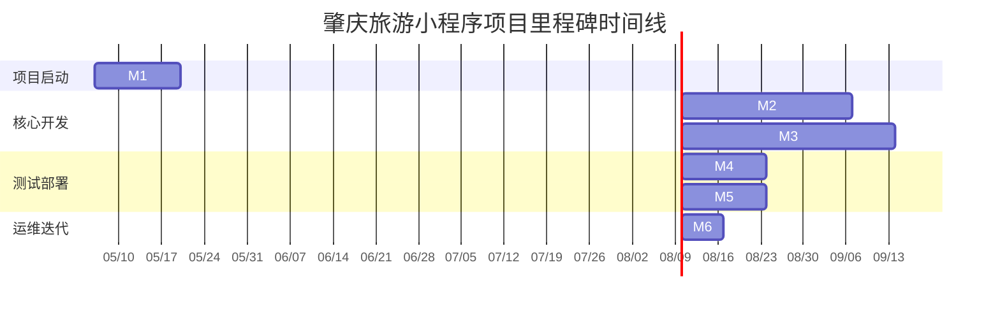

# 肇庆旅游小程序项目里程碑文档

## 文档概述
本文档基于《系统架构设计文档》和《后端API接口清单》制定肇庆旅游小程序后端系统的项目里程碑计划。项目采用微服务架构，包含9个核心微服务和79个API接口，预计总工期16周（4个月）。

## 项目基本信息
- **项目名称**: 肇庆旅游小程序后端系统
- **技术栈**: Java Spring Cloud Alibaba + MySQL + Redis + RabbitMQ + 腾讯云COS + MiniMax API
- **项目范围**: 14个功能模块，79个RESTful API接口
- **团队规模**: 后端开发团队（5-7人）
- **预计工期**: 16周（2026年5月 - 2026年8月）

## 里程碑总览

## 详细里程碑计划

### 里程碑 M1: 项目启动与基础框架搭建
**时间**: 第1-2周（2026-05-06 至 2026-05-17）
**目标**: 完成项目初始化、技术环境搭建和基础框架开发

#### 关键交付物
1. **项目章程文档**
   - 项目目标、范围、成功标准定义
   - 团队组织结构和职责划分
   - 沟通机制和决策流程

2. **技术环境配置**
   - 开发环境（IDEA、Maven、Git）统一配置
   - Docker开发环境（MySQL 8.0、Redis 7、RabbitMQ 3.12）
   - 代码仓库和分支策略建立

3. **基础框架代码**
   - Spring Cloud Alibaba基础父工程
   - 公共依赖库（工具类、异常处理、日志框架）
   - API网关基础配置（Spring Cloud Gateway）
   - 服务注册发现配置（Nacos客户端）

4. **CI/CD流水线**
   - GitLab CI/CD流水线配置
   - 自动化构建和单元测试流程
   - Docker镜像构建和推送

#### 验收标准
- [ ] 所有开发环境可正常启动和运行
- [ ] 基础框架代码通过单元测试（覆盖率>80%）
- [ ] CI/CD流水线成功执行构建和测试
- [ ] 团队所有成员完成技术培训和环境配置

### 里程碑 M2: 核心微服务开发
**时间**: 第3-6周（2026-05-20 至 2026-06-14）
**目标**: 完成核心微服务的基础CRUD功能和数据库设计

#### 关键交付物
1. **数据库设计与迁移脚本**
   - 完整的ER图和数据字典
   - 数据库迁移脚本（Flyway/Liquibase）
   - 测试数据初始化脚本

2. **核心微服务实现**
   - **用户服务**（端口:8001）：用户注册、登录、个人信息管理
   - **景点服务**（端口:8002）：景点CRUD、分类管理、收藏功能
   - **音乐服务**（端口:8003）：音乐CRUD、分类管理、播放统计
   - **食谱服务**（端口:8004）：食谱CRUD、分类管理、烹饪记录
   - **商店服务**（端口:8005）：商品CRUD、购物车基础功能

3. **API接口实现**
   - 用户管理模块（6个接口）
   - 景点管理模块（6个接口）
   - 音乐模块（8个接口）
   - 食谱模块（7个接口）
   - 商店模块基础接口（6个接口）

4. **服务间通信**
   - OpenFeign客户端配置
   - 服务调用熔断和降级（Sentinel）
   - 分布式事务基础配置（Seata可选）

#### 验收标准
- [ ] 5个核心微服务可独立部署和运行
- [ ] 数据库表结构符合设计文档，索引优化完成
- [ ] 33个核心API接口通过Postman测试
- [ ] 服务间通信正常，熔断降级机制有效
- [ ] 代码审查通过，无严重技术债务

### 里程碑 M3: 业务功能开发
**时间**: 第7-11周（2026-06-17 至 2026-07-19）
**目标**: 完成所有业务功能开发，包括AI集成、支付等复杂功能

#### 关键交付物
1. **剩余微服务实现**
   - **健康数据服务**（端口:8006）：健康数据上传、统计、运动路线
   - **AI服务**（端口:8007）：MiniMax API集成、对话管理、行程规划
   - **搜索服务**（端口:8008）：全局搜索、搜索历史、热门推荐
   - **文件服务**（端口:8009）：文件上传、COS集成、临时令牌

2. **完整API接口实现**
   - 首页数据模块（4个接口）
   - AI助手模块（6个接口）
   - 搜索模块（6个接口）
   - 播放器模块（7个接口）
   - 健康数据模块（6个接口）
   - 推荐详情模块（3个接口）
   - 收藏管理模块（3个接口）
   - 系统配置模块（2个接口）
   - 文件上传模块（3个接口）
   - 商店模块高级接口（6个接口）

3. **第三方服务集成**
   - 腾讯云COS文件存储集成
   - MiniMax AI API集成（多Agent支持）
   - 微信支付模拟/集成
   - 短信验证码服务（阿里云）

4. **高级功能实现**
   - 地理位置服务（附近景点）
   - 实时数据统计和图表
   - 消息队列应用（订单、通知、日志）
   - 缓存策略优化（多级缓存）

#### 验收标准
- [ ] 所有9个微服务开发完成，共79个API接口
- [ ] 第三方服务集成测试通过
- [ ] 复杂业务逻辑（AI对话、支付流程）验证通过
- [ ] 性能基准测试满足要求（API响应时间<500ms）
- [ ] 安全扫描通过，无高危漏洞

### 里程碑 M4: 集成测试与性能优化
**时间**: 第12-13周（2026-07-22 至 2026-08-02）
**目标**: 完成系统集成测试、性能测试和安全测试，进行性能优化

#### 关键交付物
1. **测试套件和报告**
   - 集成测试用例（200+测试用例）
   - 性能测试报告（JMeter/LoadRunner）
   - 安全测试报告（OWASP ZAP/SonarQube）
   - 兼容性测试报告（不同设备/网络环境）

2. **性能优化方案**
   - 数据库查询优化（慢查询分析、索引优化）
   - 缓存策略优化（Redis集群配置、缓存穿透防护）
   - JVM调优参数配置
   - 微服务调优（线程池、连接池配置）

3. **监控和日志系统**
   - Prometheus + Grafana监控面板
   - ELK日志收集和分析系统
   - 分布式链路追踪配置（SkyWalking/Zipkin）
   - 业务指标监控（用户活跃、订单量等）

4. **文档完善**
   - API接口文档（Swagger/OpenAPI）
   - 部署文档和运维手册
   - 故障排查指南
   - 性能优化记录

#### 验收标准
- [ ] 集成测试通过率>95%
- [ ] 性能测试指标达标（并发用户1000+，响应时间<1s）
- [ ] 安全扫描无高危和中危漏洞
- [ ] 监控系统正常运行，关键指标可观测
- [ ] 文档完整且通过评审

### 里程碑 M5: 预发布与上线
**时间**: 第14-15周（2026-08-05 至 2026-08-16）
**目标**: 完成生产环境部署、数据迁移和系统上线

#### 关键交付物
1. **生产环境部署**
   - Kubernetes集群配置（或Docker Swarm）
   - 生产环境配置文件（Nacos配置中心）
   - SSL证书配置和HTTPS启用
   - 域名解析和负载均衡配置

2. **数据迁移和备份**
   - 生产数据库初始化脚本
   - 历史数据迁移方案（如有）
   - 数据库备份和恢复策略
   - 数据一致性验证脚本

3. **上线检查清单**
   - 基础设施检查（服务器、网络、存储）
   - 应用健康检查（所有微服务状态）
   - 第三方服务连通性检查
   - 监控告警配置验证

4. **上线发布流程**
   - 蓝绿部署或金丝雀发布方案
   - 回滚方案和应急预案
   - 上线沟通和协调计划
   - 用户通知和培训材料

#### 验收标准
- [ ] 生产环境成功部署，所有服务正常运行
- [ ] 核心业务流程验证通过（注册、登录、下单、支付）
- [ ] 监控告警系统有效，关键指标正常
- [ ] 上线后24小时内无P0/P1级别故障
- [ ] 用户反馈渠道畅通，问题响应机制建立

### 里程碑 M6: 运维支持与迭代规划
**时间**: 第16周（2026-08-19 至 2026-08-23）
**目标**: 系统稳定运行支持，收集用户反馈，规划后续迭代

#### 关键交付物
1. **运维支持体系**
   - 7x24小时运维值班表
   - 故障应急响应流程（SOP）
   - 问题跟踪和解决记录
   - 系统健康度周报

2. **用户反馈分析**
   - 用户行为数据分析报告
   - 功能使用率统计
   - 用户满意度调查结果
   - 常见问题汇总和解决方案

3. **迭代规划文档**
   - 下一迭代需求收集和优先级排序
   - 技术债务清理计划
   - 性能优化路线图
   - 功能扩展规划（二期功能）

4. **项目总结报告**
   - 项目成果总结（KPI达成情况）
   - 经验教训总结（成功经验和改进点）
   - 团队绩效评估
   - 知识库和资产归档

#### 验收标准
- [ ] 系统稳定运行一周，可用性>99.5%
- [ ] 用户反馈收集机制有效运行
- [ ] 运维团队完成交接和培训
- [ ] 下一迭代详细规划完成
- [ ] 项目总结报告通过评审

## 风险管理计划

### 技术风险
| 风险描述 | 影响程度 | 发生概率 | 应对措施 |
|---------|---------|---------|---------|
| 微服务间通信故障 | 高 | 中 | 实施熔断降级机制，加强监控告警 |
| 数据库性能瓶颈 | 高 | 中 | 提前进行分库分表设计，优化查询 |
| 第三方服务不稳定 | 中 | 高 | 设计降级方案，缓存备用数据 |
| 部署环境差异 | 中 | 低 | 使用容器化部署，环境配置标准化 |

### 项目风险
| 风险描述 | 影响程度 | 发生概率 | 应对措施 |
|---------|---------|---------|---------|
| 需求变更频繁 | 高 | 中 | 建立变更控制流程，迭代式开发 |
| 关键人员流失 | 高 | 低 | 知识共享，文档完善，交叉培训 |
| 进度延误 | 中 | 中 | 定期进度检查，风险预警，资源调整 |
| 质量不达标 | 高 | 低 | 严格代码审查，自动化测试，持续集成 |

### 业务风险
| 风险描述 | 影响程度 | 发生概率 | 应对措施 |
|---------|---------|---------|---------|
| 用户量增长超预期 | 中 | 中 | 设计可扩展架构，预留资源弹性 |
| 支付集成问题 | 高 | 低 | 提前与支付服务商沟通，准备备用方案 |
| 数据安全合规 | 高 | 低 | 遵循数据安全法规，定期安全审计 |
| 竞争产品出现 | 中 | 中 | 持续收集用户反馈，快速迭代优化 |

## 沟通与报告机制

### 日常沟通
- **每日站会**: 工作日早上9:30，15分钟，同步进度和问题
- **技术讨论**: 随时通过企业微信/钉钉群沟通技术问题
- **代码审查**: 所有代码合并前必须经过至少1人审查

### 定期报告
- **周报**: 每周五下午提交，包含进度、问题和下周计划
- **里程碑评审**: 每个里程碑结束后进行正式评审会议
- **月度汇报**: 每月向项目干系人汇报整体进展

### 会议安排
- **项目启动会**: M1开始前
- **设计评审会**: M1结束后
- **里程碑评审会**: 每个里程碑结束后
- **上线准备会**: M5开始前
- **项目总结会**: M6结束后

## 资源需求

### 人力资源
| 角色 | 人数 | 主要职责 | 参与阶段 |
|-----|-----|---------|---------|
| 项目经理 | 1 | 项目规划、进度跟踪、风险管理 | 全程 |
| 架构师 | 1 | 技术架构设计、技术决策、代码审查 | M1-M4 |
| 后端开发 | 4-6 | 微服务开发、API实现、单元测试 | M2-M5 |
| 测试工程师 | 2 | 测试用例设计、执行、报告 | M3-M5 |
| DevOps工程师 | 1 | 环境搭建、CI/CD、部署运维 | M1-M6 |

### 硬件资源
| 资源类型 | 开发环境 | 测试环境 | 生产环境 |
|---------|---------|---------|---------|
| 服务器 | 4核8G x 3 | 8核16G x 5 | 16核32G x 10 |
| 数据库 | MySQL 8.0 | MySQL集群 | MySQL主从+读写分离 |
| 缓存 | Redis单节点 | Redis哨兵 | Redis Cluster |
| 存储 | 本地存储 | 云存储 | 腾讯云COS |

### 软件工具
| 工具类别 | 工具名称 | 用途 |
|---------|---------|------|
| 开发工具 | IntelliJ IDEA, VS Code | 代码开发 |
| 版本控制 | Git, GitLab | 代码管理 |
| 构建工具 | Maven, Docker | 构建和打包 |
| 测试工具 | JUnit, Postman, JMeter | 测试执行 |
| 监控工具 | Prometheus, Grafana, ELK | 系统监控 |

## 成功标准

### 技术成功标准
1. **系统性能**: API平均响应时间<300ms，P99响应时间<1s
2. **系统可用性**: 生产环境可用性>99.5%
3. **代码质量**: 单元测试覆盖率>80%，代码重复率<5%
4. **安全合规**: 通过安全扫描，无高危漏洞

### 业务成功标准
1. **功能完整**: 所有79个API接口按需求实现
2. **用户体验**: 用户操作流畅，无关键流程阻塞
3. **上线成功**: 系统按时上线，核心功能正常运行
4. **用户反馈**: 上线后用户满意度>4.0（5分制）

### 项目成功标准
1. **按时交付**: 在16周内完成所有里程碑
2. **预算控制**: 项目成本控制在预算范围内
3. **团队成长**: 团队成员技能提升，知识沉淀
4. **过程规范**: 开发流程规范，文档完整

## 附录

### 附录A: 微服务拆分对照表
| 微服务 | 对应API模块 | 接口数量 | 负责人 | 预计工期 |
|-------|------------|---------|--------|---------|
| 用户服务 | 用户管理模块 | 6 | 张三 | 3周 |
| 景点服务 | 景点管理模块、首页数据模块 | 10 | 李四 | 4周 |
| 音乐服务 | 音乐模块、播放器模块 | 15 | 王五 | 4周 |
| 食谱服务 | 食谱模块 | 7 | 赵六 | 3周 |
| 商店服务 | 商店模块 | 12 | 钱七 | 4周 |
| 健康数据服务 | 健康数据模块 | 6 | 孙八 | 3周 |
| AI服务 | AI助手模块 | 6 | 周九 | 3周 |
| 搜索服务 | 搜索模块 | 6 | 吴十 | 3周 |
| 文件服务 | 文件上传模块 | 3 | 郑十一 | 2周 |

### 附录B: 关键依赖关系
1. **外部依赖**:
   - MiniMax API: AI对话功能
   - 腾讯云COS: 文件存储
   - 微信支付: 支付功能
   - 阿里云短信: 短信验证码

2. **内部依赖**:
   - Nacos: 服务注册发现和配置中心
   - Sentinel: 流量控制和熔断降级
   - Redis: 分布式缓存和会话管理
   - RabbitMQ: 异步消息处理

### 附录C: 质量检查清单
- [ ] 代码规范检查（Checkstyle/Spotless）
- [ ] 单元测试覆盖率报告
- [ ] 集成测试通过率报告
- [ ] 性能测试结果达标
- [ ] 安全扫描无高危漏洞
- [ ] 文档完整性和准确性
- [ ] 部署脚本验证通过
- [ ] 回滚方案测试通过

---
*文档版本: 1.0*
*创建日期: 2026-05-05*
*基于文档: system_architecture_design.md, backend_api_interfaces.md*
*下次评审: 2026-05-12*